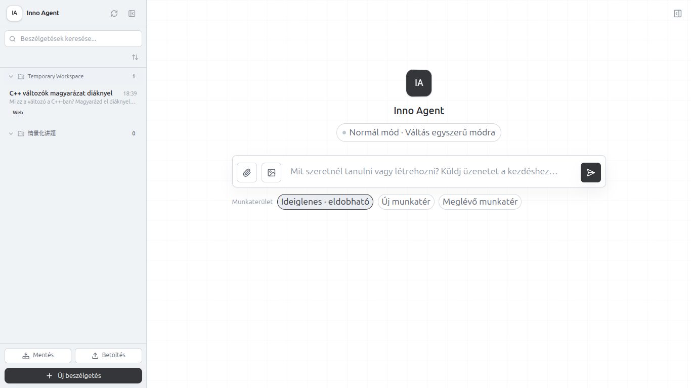
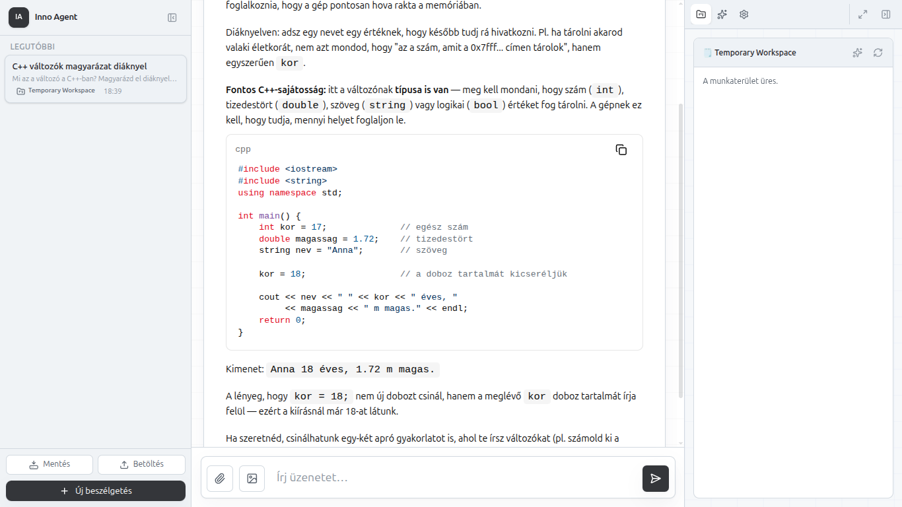
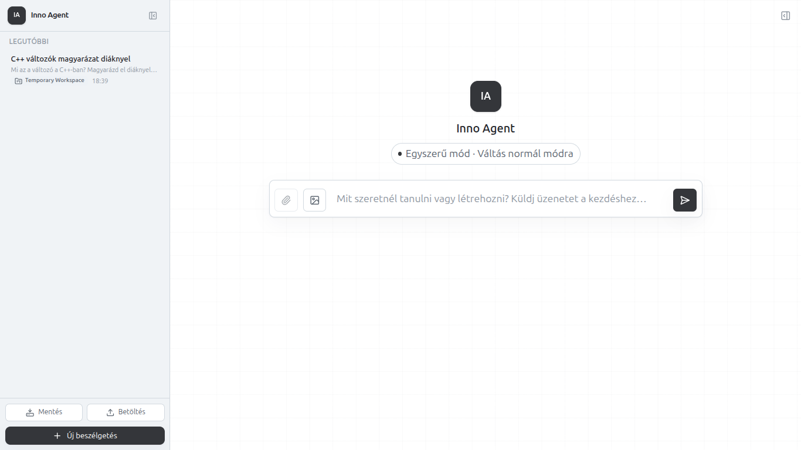
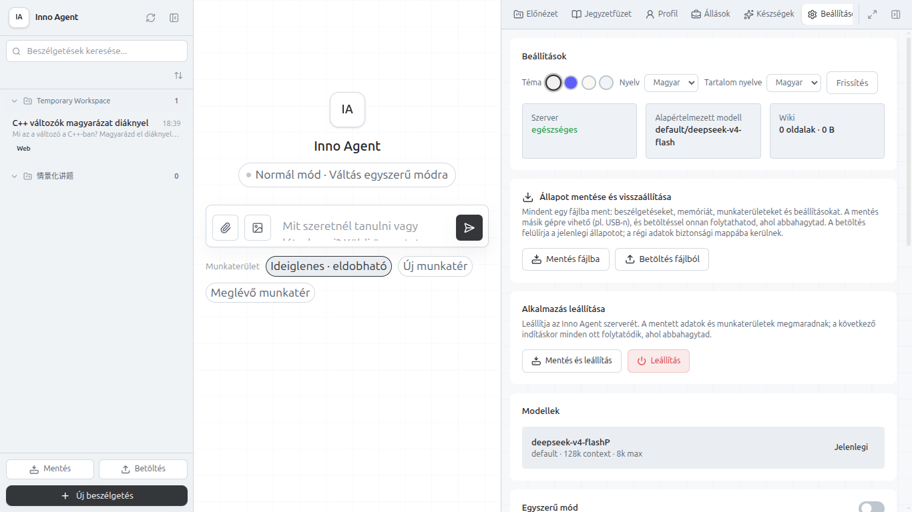
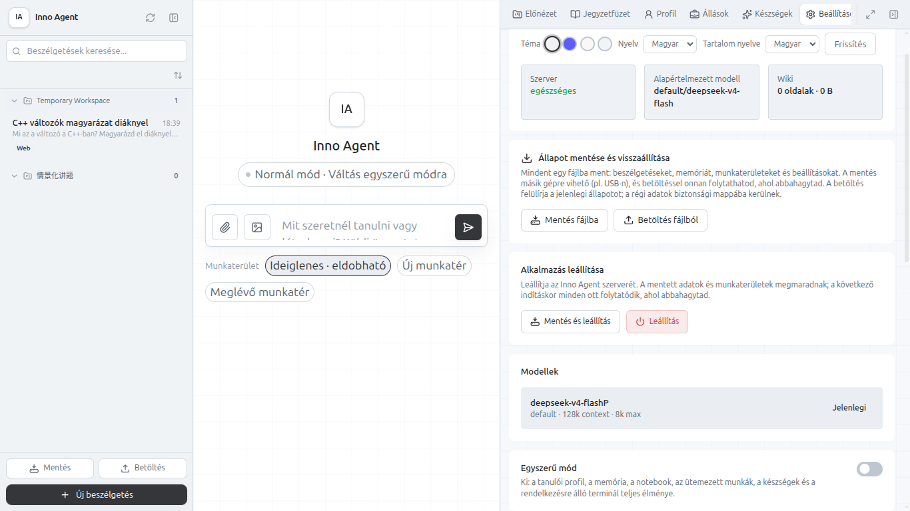

# Inno Agent — bemutató kollégáknak

Az Inno Agent egy személyes tanulási ügynök, amely böngészőben fut
(localhost), és a diák a saját gépén használja: kérdezhet, feladatokat
oldhat meg, a tanár pedig előre elkészített munkaterületeket adhat neki.
Minden diák saját állapota (beszélgetések, memória, munkaterületek)
megmarad, és **egyetlen fájlba menthető / onnan visszatölthető** — így a
diák másik gépen, vagy egy másik diák után is ott folytathatja, ahol
abbahagyta.

---

## 1. Előfeltételek

- Linux, macOS vagy Windows 10+ gép
- `git`
- Node.js **>= 20.6** (és npm) — a telepítő ellenőrzi, és hibaüzenetet ad, ha hiányzik
- Internetkapcsolat a telepítés idejére

---

## 2. Telepítés egy paranccsal (curl)

A telepítő egyetlen sorral futtatható, letöltés és kézi lépések nélkül:

```bash
curl -fsSL https://cdn.jsdelivr.net/gh/karsarobert/inno-agent-hub/install.sh | sh
```

Windows PowerShellben ugyanez:

```powershell
irm https://cdn.jsdelivr.net/gh/karsarobert/inno-agent-hub/install.ps1 | iex
```

A telepítő automatikusan:

1. ellenőrzi a rendszert és az előfeltételeket (git, Node.js),
2. letölti az alkalmazást a `karsarobert/inno-agent` tárolóból,
3. telepíti a függőségeket és lefordítja az alkalmazást,
4. **tiszta konfigurációt** ír, amelyben a tartalomközpont alapból a tanári
   GitHub-hubra mutat (`karsarobert/inno-agent-hub` — innen jönnek a
   készségek és a munkaterület-kártyák),
5. asztali indítóparancsot és menübejegyzést hoz létre,
6. elindítja a szervert, és kiírja a címet.

A futás kimenete (Linux):

```
────────────────────────────────────────────────────
  Inno Agent installer
────────────────────────────────────────────────────

  System         detecting OS and architecture...
  System         linux/x64
  Prereq         checking git...
  Prereq         git 2.43.0
  Prereq         checking Node.js (>=20.6)...
  Prereq         node v24.10.0
  Prereq         npm 11.6.1
  Install        preparing ~/.local/opt/inno-agent...
  Install        repo ready
  Build          npm install (this can take a while)...
  Build          npm run build...
  Build          built
  Config         writing clean runtime config...
  Config         placeholder provider written; set the real one in Settings UI
  Config         contentHub: github
  Menu           launcher installed (Inno Agent in the app menu)
  Start          starting Inno Agent on :3000...
  Start          healthy

────────────────────────────────────────────────────
  Inno Agent installed
────────────────────────────────────────────────────

                 Web UI:  http://localhost:3000
                 Install: ~/.local/opt/inno-agent
                 Config:  ~/.local/opt/inno-agent/runtime/config/config.json
                 Log:     ~/.local/opt/inno-agent/inno-agent.log

                 Content hub: GitHub karsarobert/inno-agent-hub (main)
                 To disable it, use Settings > Content Hub in the UI or INNO_HUB_TYPE=none.
```

> Windows esetén a letöltés helye `%USERPROFILE%\.local\opt\inno-agent` lesz.
> A telepítés után az alkalmazás az **Alkalmazásmenüből is indítható**
> (Inno Agent bejegyzés), nem csak a parancssorból.

Tippek a telepítőhöz (opcionális környezeti változók):

```bash
# Másik port (pl. ha a 3000 foglalt):
curl -fsSL https://cdn.jsdelivr.net/gh/karsarobert/inno-agent-hub/install.sh | INNO_PORT=3010 sh

# Tartalomközpont kikapcsolása (offline telepítés: nincs skill, nincs kártya):
curl -fsSL https://cdn.jsdelivr.net/gh/karsarobert/inno-agent-hub/install.sh | INNO_HUB_TYPE=none sh

# Saját LLM-szolgáltató megadása már telepítéskor:
curl -fsSL https://cdn.jsdelivr.net/gh/karsarobert/inno-agent-hub/install.sh \
  | INNO_PROVIDER_BASE_URL=https://api.deepseek.com \
    INNO_PROVIDER_API_KEY=sk-... \
    INNO_PROVIDER_MODEL=deepseek-v4-flash sh
```

Ha nem adunk meg szolgáltatót, a beállításokat a böngészőből, a
**Beállítások** fülön lehet megadni (lásd lentebb).

---

## 3. Első indítás

Böngészőben nyisd meg: **http://localhost:3000**

Alapból a **normál mód** fogad: bal oldalt a beszélgetések listája (a
Mentés/Betöltés gombokkal), középen az üzenetbevitel és a munkaterület-
választó.



Az **egyszerű mód** egy lecsupaszított nézet (csak a legutóbbi
beszélgetések + új beszélgetés), amelyet a „Váltás egyszerű módra" gombbal
bárki bekapcsolhat.

> **Megjegyzés:** jelenleg a diákok és a tanárok ugyanazt a felületet
> látják; a diák- és tanárszerep különválasztása (pl. diákoknál rögzített
> egyszerű mód, rejtett beállítások) későbbi fejlesztés.

---

## 4. Beszélgetés az ügynökkel

A diák egyszerű magyar nyelven kérdez — az ügynök a tanuló szintjéhez
igazított magyarázatot ad, és a munkaterületen fájlokat is létrehozhat.



Példa kérdés: *„Mi az a változó a C++-ban? Magyarázd el diáknyelven, egy
rövid példával!"* — az ügynök lépésről lépésre, példákkal magyaráz.

---

## 5. Állapot mentése és visszaállítása (a diák „előzménye")

A diák teljes állapota — beszélgetések, hosszú távú memória,
munkaterületek és fájlok, tanulói profil, beállítások — **egyetlen ZIP
fájlba** menthető, és onnan visszatölthető.

**Mentés:** a bal oldali sáv alján a **„Mentés"** gomb → a böngésző
letölt egy `inno-agent-mentes-<dátum>.zip` fájlt. Ezt a diák elteheti
pendrive-ra, feltöltheti a felhőbe, vagy elküldheti magának.

**Betöltés:** a **„Betöltés"** gombbal kiválasztja a mentési fájlt → az
app visszaállítja a teljes állapotot (beszélgetések, memória,
munkaterületek), és onnan folytathatja, ahol abbahagyta. A gépen lévő
régi állapot nem vész el: biztonsági mappába kerül
(`data/.restore-trash/`).



Tipikus használat:

- az óra végén a diák **Mentés** → másnap, másik gépen: telepítés →
  **Betöltés** → ugyanott folytatja;
- ha a gépen az előző órán másik diák dolgozott, a betöltéssel a saját
  utolsó állapota tér vissza (a másik diák adatai nem törlődnek, csak
  félrekerülnek).

A tanári nézetben (Beállítások) ugyanez teljes kártyaként érhető el:



---

## 6. Mentés és leállítás

A Beállítások **„Alkalmazás leállítása"** kártyáján két gomb van:

- **Leállítás** — egyszerűen leállítja az alkalmazást;
- **Mentés és leállítás** — előbb elmenti a teljes állapotot a szerver
  `exports` mappájába (`runtime/data/exports/`), majd leáll.



Ez az automatikus mentés akkor hasznos, ha a portál (pl. a tanári
szerver) a kilépéskor automatikusan bekéri a mentési fájlt.

---

## 7. Frissítés — mi marad meg, mi nem

A frissítés ugyanaz a parancs, mint a telepítés:

```bash
curl -fsSL https://cdn.jsdelivr.net/gh/karsarobert/inno-agent-hub/install.sh | sh
```

A telepítő ilyenkor csak a **programkódot** frissíti (letöltés + fordítás).
**Megmarad:**

- minden beszélgetés (`data/sessions/`),
- a memória (`data/l3/`, `data/l2/`),
- a munkaterületek és a bennük lévő fájlok (`workspace/`),
- a tanulói profil, a letöltött készségek és a felhasználói beállítások.

**Ami ilyenkor újra beállítandó:** a `config.json` — vagyis a
szolgáltató/API-kulcs. A telepítő frissítéskor tiszta konfigurációt ír,
ezért az óra után a Beállításokban újra meg kell adni az LLM-szolgáltatót
(vagy a fenti `INNO_PROVIDER_*` változókkal egyszerre telepíteni).
Biztonság kedvéért frissítés előtt érdemes **Mentés fájlba**-t készíteni.

---

## 8. Gyors áttekintés (puska)

| Feladat | Hogyan? |
|---|---|
| Telepítés | `curl -fsSL https://cdn.jsdelivr.net/gh/karsarobert/inno-agent-hub/install.sh \| sh` |
| Megnyitás | http://localhost:3000 (vagy Inno Agent az alkalmazásmenüből) |
| Normál / egyszerű mód | „Váltás egyszerű módra" gomb — a szerepkörök szétválasztása későbbi fejlesztés |
| Állapot mentése | bal oldali sáv → **Mentés** |
| Visszaállítás | bal oldali sáv → **Betöltés** (zip kiválasztása) |
| Mentés leálláskor | Beállítások → **Mentés és leállítás** |
| Frissítés | ugyanaz a curl parancs — az előzmények megmaradnak |
| Napló / hibakeresés | `~/.local/opt/inno-agent/inno-agent.log` |

---

*Dokumentum verzió: 2026-08-22 · A képernyőképek valódi futó alkalmazásról
készültek (Inno Agent 0.4.4, mentés/visszaállítás funkcióval).*
