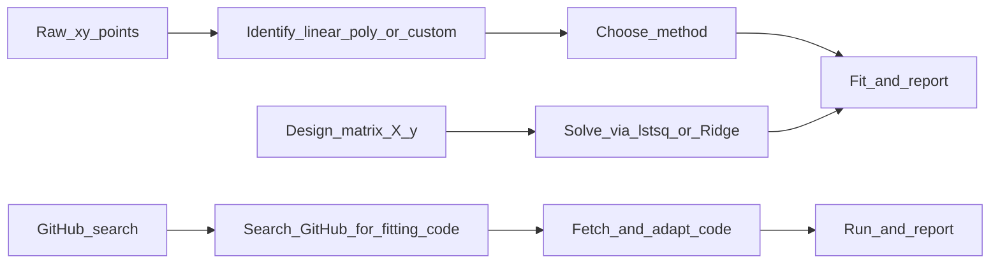

<!--
  Szerző: Li Shuangxi
  Adatforrás: néhány benchmark-példa adata a NIST Statistical Reference Datasets (StRD) gyűjteményből származik.
  https://itl.nist.gov/div898/strd/nls/nls_main.shtml
  A NIST-adatok az Egyesült Államok kormányának közkincs termékei; szabadon használhatók, a forrást fel kell tüntetni.
-->

# Legkisebb négyzetes illesztés: adatmodellezés és paraméterbecslés

## Alkalmazási helyzetek

- **Lineáris regresszió**: változók közötti lineáris kapcsolat felállítása, például `y = a + bx` értékesítési trend illesztésére
- **Polinomiális illesztés**: nemlineáris, de sima kapcsolat illesztése, például `y = a + bx + cx^2` növekedési görbéhez
- **Egyéni modell illesztése**: ismert függvényalak használata, például exponenciális lecsengés `y = a*exp(-bx) + c`
- **Súlyozott illesztés**: eltérő pontosságú adatpontok kezelése, például ismert varianciájú mérések
- **Regularizált regresszió**: túlillesztés megelőzése és multikollinearitás kezelése, például Ridge/Lasso regresszió
- **Korlátos illesztés**: a paramétereknek fizikai alsó-felső korlátja vagy egyenlőségi korlátja van, például a koncentráció pozitív
- **Bayes-i illesztés**: paraméterek poszterior eloszlására van szükség, például MCMC-mintavételezéssel

**Bemenet**: lehetnek **(x, y) adatpontok**, vagy egy már felépített **X, y tervezési mátrix**.

## Quick Start (először ezt végezd el)

Hajtsd végre az alábbi ellenőrzőlistát, és a válaszban őrizd meg a szerkezetét. **A környezet előkészítésének meg kell előznie az illesztést.**

- [ ] **Környezet előkészítése és függőségek telepítése (kötelező első lépés)**:
  1. Vizsgáld meg a Python-környezetben már telepített tudományos csomagokat: `pip list | findstr -i "numpy scipy scikit-learn statsmodels lmfit matplotlib cvxpy iminuit nlopt jax emcee"` vagy `pip list | grep -iE "numpy|scipy|scikit-learn|statsmodels|lmfit|matplotlib|cvxpy|iminuit|nlopt|jax|emcee"`
  2. Szükség szerint sorold fel az elérhető és hiányzó csomagokat, majd **kérdezd meg a felhasználót**, telepíthetők-e a hiányzók
  3. A felhasználó jóváhagyása után telepíts: `pip install numpy scipy scikit-learn matplotlib`
  4. A telepítés után ellenőrizd az importálást:
     ```python
     import numpy; import scipy; import sklearn
     print(f"numpy={numpy.__version__}, scipy={scipy.__version__}, sklearn={sklearn.__version__}")
     ```
  5. Ha egyik sem használható és a telepítés sikertelen → kövesd a GitHub-keresési útvonalat
- [ ] Útvonal meghatározása: a felhasználó adatpontokat/tervezési mátrixot adott-e, vagy GitHub-kód keresését kérte
- [ ] Adatelőkészítés: biztosítsd, hogy x és y azonos hosszúságú numpy tömb legyen, NaN/Inf nélkül
- [ ] Problémaazonosítás: lineáris, polinomiális, egyéni függvényes, korlátos vagy Bayes-i illesztésről van-e szó
- [ ] Eszközválasztás: az elérhető eszközöket részesítsd előnyben (`scipy.curve_fit > numpy.linalg.lstsq > numpy.polyfit > scikit-learn > lmfit > cvxpy > iminuit > nlopt > jaxopt > emcee > statsmodels > GitHub keresés`)
- [ ] Illesztés végrehajtása: hívd a megfelelő függvényt, és kezeld a lehetséges kivételeket
- [ ] Eredményellenőrzés: számítsd ki a maradékokat és az R^2 értéket, majd szemléltesd az illesztés minőségét

## Végrehajtási folyamat (három útvonal)



### A útvonal: meglévő X, y tervezési mátrix

1. Ellenőrizd a dimenziókat: `X` sorainak száma egyezzen `y` hosszával.
2. Oldd meg közvetlenül `np.linalg.lstsq`, `Ridge` vagy `Lasso` használatával.

### B útvonal: nyers (x, y) adatpontok

Ha a felhasználó nem adott tervezési mátrixot, az alábbi szállítandók sorrendjében haladj:

| Lépés | Tartalom |
|------|------|
| 1. Visszafogalmazás | Egy-két mondatban fogalmazd újra az illesztési igényt, hogy a felhasználó megerősíthesse. |
| 2. Módszerválasztás | Lineáris/polinomiális/egyéni függvény? Ha nincs megadva, az alapértelmezett lineáris. |
| 3. Illesztés | Hívd a megfelelő függvényt, és kezeld a lehetséges kivételeket. |
| 4. Kiértékelés | Add meg az R^2 értéket, a maradékokat, a paraméterbecslést és annak hibáját. |

### C útvonal: nyílt forrású kód keresése a GitHubon

Ha helyben nem áll rendelkezésre tudományos számítási könyvtár (probléma van a numpy/scipy-val), **vagy a felhasználó kifejezetten GitHub-kódot kér**, ezt az útvonalat kövesd.

**1. lépés: keresés**
A GitHubon WebSearch segítségével keress az alábbi kulcsszóformátummal:
```
site:github.com least squares fitting python <probléma_jellemzője>
```
Például: `site:github.com least squares polynomial fitting python`, `site:github.com weighted least squares regression python`

**2. lépés: szűrés**
- Előnyben részesítendők a sok csillaggal rendelkező, nemrég frissített, README-t tartalmazó tárolók
- Előnyben részesítendő a tiszta Python + numpy megvalósítás (fordítás nélkül)
- Ellenőrizd, hogy a kód támogatja-e az aktuális problématípust (lineáris/polinomiális/egyéni függvény)

**3. lépés: kód beszerzése**
WebFetch használatával töltsd le a tároló README-jét és a kulcsfontosságú Python-fájlokat; értsd meg az API-jukat és hívási módjukat.

**4. lépés: adaptálás és futtatás**
- Alakítsd a felhasználó adatait a kód által elvárt bemeneti formátumra
- Írj hívó szkriptet, majd futtasd az illesztést
- Ha a kód hibás vagy nem illeszthető, jelezd a felhasználónak, és próbáld javítani

**5. lépés: jelentés**
Az alábbi kimeneti sablon szerint add meg az eredményt, és tüntesd fel a kód forrását (GitHub URL).

## Kimeneti sablon (ajánlott)

A választ lehetőleg az alábbi sablon szerint szervezd:

```markdown
### Környezet és függőségek
- Python-verzió: 3.x.x
- Környezetvizsgálat eredménye:
  - [telepítve] numpy 2.x.x
  - [telepítve] scipy 1.x.x
  - [telepítve] scikit-learn 1.x.x
  - [nincs telepítve] statsmodels — a felhasználó nem kéri a telepítését (nem szükséges)
  - [nincs telepítve] lmfit — pip install lmfit (1.8s, telepítés sikeres ✓)
- Telepítési műveletek naplója:
  - pip install lmfit → sikeres (version 1.3.2)
- Választott eszköz: scipy.optimize.curve_fit

### Probléma újrafogalmazása
...

### Illesztési módszer
- Modell típusa: ...
- Megoldó/könyvtár: ...

### Illesztés eredménye
- Paraméterek: ...
- Paraméterhibák: ...

### Illesztés minősége
- R^2 = ...
- Maradéknégyzetösszeg = ...
- RMSE = ...

### Diagnosztikai információk
- Kondíciószám: ...
- Megoldási idő: ...
- Illesztési módszer: ...

### Vizualizációs javaslat
...
```

## Kétértelműségek és tisztázás

- **Mikor kérdezz**:
  - Ha nincs megadva a polinom foka: "Hányadfokú polinommal szeretné az illesztést?"
  - Ha nincs megadva a regularizáció erőssége: "Mennyi legyen az alpha regularizációs paraméter?"
  - Ha az egyéni függvényhez hiányoznak a kezdő paraméterek: "Adjon kezdeti becslést a paraméterekre"
- **Mikor tételezz fel alapértelmezést**:
  - Ha nincs megadva a modell típusa, használj lineáris illesztést
  - Ha nincs megadva súly, tételezz fel azonos súlyokat
  - Ha nincs megadva regularizáció, ne használj regularizációt
- **Gyakori kétértelműségek kezelése**:
  1. "Görbeillesztés": alapértelmezésként 2. fokú polinom; kérdezd meg, elfogadható-e
  2. "Pontos illesztés": használj magasabb fokú polinomot, de figyelmeztess a túlillesztés veszélyére
  3. "Túlillesztés megelőzése": automatikusan adj hozzá L2 regularizációt (Ridge)
  4. "Jellemzőválasztás": javasolj L1 regularizációt (Lasso)

## Hatókör és korlátok (e skill határai)

### Mire képes

- Lineáris/polinomiális legkisebb négyzetek (<= 20. fok)
- Egyéni nemlineáris függvények illesztése (<= 10 paraméter)
- Súlyozott legkisebb négyzetek (ismert variancia vagy súlyok)
- Regularizált regresszió (Ridge, Lasso, ElasticNet)
- Korlátos legkisebb négyzetek (cvxpy vagy iminuit használatával)
- MCMC Bayes-i illesztés (emcee használatával)
- Kis és közepes adathalmazok (mintaszám <= 10^5, jellemzőszám <= 1000)

### Mire nem képes

- Nem Gauss-hibájú maximum likelihood becslés
- Nagy adathalmazok illesztése (online/elosztott algoritmus szükséges)
- Nem legkisebb négyzetes robusztus regresszió (például Huber, RANSAC) — használható hozzá a scikit-learn
- Automatikus modellválasztás (a modellalakot embernek kell megadnia)

### Tájékoztatás a hatókörön kívüli esetekben

- Javasolt alternatív eszközök: `statsmodels` (statisztikai következtetés), `lmfit` (haladó illesztés)
- Nagy adathalmazhoz használd a `sklearn.linear_model.SGDRegressor` eszközt
- Adj egyszerűsítési javaslatot: dimenziócsökkentés, mintavételezés vagy egyszerűbb modell használata

## Környezet és importok

```python
import numpy as np
import scipy
from scipy.optimize import curve_fit, least_squares

# Gépi tanulás (regularizált regresszió)
import sklearn
from sklearn.linear_model import LinearRegression, Ridge, Lasso, ElasticNet

# Statisztikai következtetés
import statsmodels.api as sm        # Teljes statisztikai kimenet (p-értékek, konfidenciaintervallumok)
import lmfit                        # Haladó nemlineáris illesztés (paraméterkorlátok, modell-összevetés)

# Vizualizáció
import matplotlib.pyplot as plt

# Korlátos illesztés
import cvxpy as cvx                 # Apache 2.0, konvex optimalizálás korlátokkal

# Haladó nemlineáris optimalizálás
import iminuit                      # MIT, CERN Minuit nemlineáris optimalizálás
import nlopt                        # LGPL, nemlineáris optimalizáló könyvtár (több algoritmus)

# JAX ökoszisztéma (automatikus differenciálás + optimalizálás)
import jax                          # Apache 2.0, automatikus differenciálás
import jaxopt                       # JAX optimalizáló eszközök

# MCMC Bayes-i illesztés
import emcee                        # MIT, affin invariáns MCMC-mintavevő
```

## Többeszközös támogatás

Ez a skill többféle illesztőeszközt támogat. Eszköz-prioritás: **scipy.curve_fit > numpy.linalg.lstsq > numpy.polyfit > scikit-learn > lmfit > cvxpy > iminuit > nlopt > jaxopt > emcee > statsmodels > GitHub keresés**.

---

### Tier 1: alapvető eszközök (nulla extra függőség, teljes lefedettség)

#### numpy.linalg.lstsq (lineáris legkisebb négyzetek, extra függőség nélkül)

```python
import numpy as np

# X tervezési mátrix (m x n), megfigyelt y értékek (m,)
beta, residuals, rank, s = np.linalg.lstsq(X, y, rcond=None)
y_pred = X @ beta
r2 = 1 - np.sum((y - y_pred)**2) / np.sum((y - np.mean(y))**2)
```

Jellemzők: nincs további telepítés, közvetlen megoldás normálegyenletekkel, lineáris modellekhez alkalmas.

#### numpy.polyfit / polyval (polinomiális illesztés)

```python
coeffs = np.polyfit(x, y, deg=2)
y_pred = np.polyval(coeffs, x)
```

Jellemzők: egysoros polinomiális illesztés, automatikus Vandermonde-mátrixkezelés, sima trendekhez alkalmas.

#### scipy.optimize.curve_fit (egyéni nemlineáris illesztés)

```python
from scipy.optimize import curve_fit

def model(x, a, b, c):
    return a * np.exp(-b * x) + c

popt, pcov = curve_fit(model, x, y, p0=[1.0, 1.0, 0.0], method='trf')
perr = np.sqrt(np.diag(pcov))
```

Jellemzők: egyéni függvényalak, `lm`/`trf`/`dogbox` módszerek támogatása; a `trf` összetett modellekhez (például racionális függvényekhez) alkalmas, paraméterhatárokkal.

#### scipy.optimize.least_squares (általános nemlineáris legkisebb négyzetek)

```python
from scipy.optimize import least_squares

def residuals(params, x, y):
    return y - model(x, *params)

result = least_squares(residuals, x0=[...], args=(x, y),
                       bounds=([lower], [upper]), method='trf')
```

Jellemzők: rugalmasabb maradékdefiníció, több módszer (`trf`/`dogbox`/`lm`), ritka Jacobi-mátrix támogatása, nagyméretű problémák kezelése.

---

### Tier 2: kiterjesztett eszközök (statisztikai következtetés + haladó illesztés)

#### scikit-learn (regularizált regresszió, gépi tanulási ökoszisztéma)

```python
from sklearn.linear_model import LinearRegression, Ridge, Lasso, ElasticNet
from sklearn.preprocessing import StandardScaler

scaler = StandardScaler()
Xs = scaler.fit_transform(X)

ridge = Ridge(alpha=1.0).fit(Xs, y)
lasso = Lasso(alpha=0.1, max_iter=10000).fit(Xs, y)
elastic = ElasticNet(alpha=0.1, l1_ratio=0.5).fit(Xs, y)
```

Telepítés: `pip install scikit-learn`
Jellemzők: Ridge (L2), Lasso (L1), ElasticNet (L1+L2), alpha automatikus kiválasztása keresztvalidációval, standardizáló előfeldolgozás, jellemzőválasztás.

#### statsmodels (bővített statisztikai következtetés)

Használd, ha a felhasználónak p-értékekre, konfidenciaintervallumokra, ANOVA-ra vagy más teljes statisztikai kimenetre van szüksége:

```python
import statsmodels.api as sm

X = sm.add_constant(x)  # Konstans tag hozzáadása
model = sm.OLS(y, X)
results = model.fit()
print(results.summary())  # Teljes statisztikai jelentés
print(results.pvalues)    # Az egyes paraméterek p-értékei
print(results.conf_int()) # Konfidenciaintervallumok
print(results.rsquared)   # R^2
print(results.aic, results.bic)  # Információs kritériumok
```

Telepítés: `pip install statsmodels`
Jellemzők: teljes, R-stílusú kimenet; p-érték/t-próba/F-próba; maradékdiagnosztika (DW/d-próba stb.); információs kritériumok (AIC/BIC); heteroszkedaszticitás-robosztus standard hibák.

#### lmfit (haladó nemlineáris illesztés)

Ha a curve_fit nem elég rugalmas (paraméterkorlátok, többmodell-összevetés stb.):

```python
from lmfit import Model

def func(x, a, b, c):
    return a * np.exp(-b * x) + c

model = Model(func)
params = model.make_params(a=5, b=1, c=0)
params['a'].set(min=0)  # Paraméterkorlát
params['b'].set(min=0, max=10)
result = model.fit(y, params, x=x)
print(result.fit_report())  # Hibákat, korrelációt és khí-négyzetet tartalmaz
print(result.best_values)   # Optimális paraméterek
print(result.covar)         # Kovarianciamátrix
```

Telepítés: `pip install lmfit`
Jellemzők: paraméterkorlátok (min/max/expr/vary), többmodell-összevetés, összetett modellek, beépített spektrumvonal-modellek (Gaussian/Lorentzian/Voigt), egyéni célfüggvény.

#### cvxpy (korlátos legkisebb négyzetek)

Ha a paraméterekre lineáris vagy kvadratikus korlátok vonatkoznak (például nemnegativitás, összegkorlát, paraméterkapcsolat):

```python
import cvxpy as cvx

# Korlátos legkisebb négyzetek: min ||A x - b||_2 s.t. x >= 0, sum(x) == 1
x = cvx.Variable(n)
objective = cvx.Minimize(cvx.norm(A @ x - b, 2))
constraints = [x >= 0, cvx.sum(x) == 1]
prob = cvx.Problem(objective, constraints)
prob.solve(solver=cvx.CLARABEL)

# Vagy kvadratikus regularizációval: min ||A x - b||_2^2 + lambda * ||x||_2^2
x = cvx.Variable(n)
objective = cvx.Minimize(cvx.sum_squares(A @ x - b) + lam * cvx.sum_squares(x))
prob = cvx.Problem(objective)
prob.solve()
```

Telepítés: `pip install cvxpy`
Jellemzők: legkisebb négyzetek konvex korlátok mellett; lineáris/kvadratikus/kúp-korlátok; több megoldó backend; SOCP/SDP; fizikai korlátokhoz alkalmas (például nemnegatív koncentráció, 1-gyé összegződő valószínűségek).

---

### Tier 3: haladó optimalizáló eszközök

#### iminuit (CERN Minuit, nemlineáris optimalizálás)

```python
from iminuit import Minuit
from iminuit.cost import LeastSquares

# LeastSquares költségfüggvény használata
least_squares_cost = LeastSquares(x, y, yerr, model)
m = Minuit(least_squares_cost, a=1.0, b=1.0, c=0.0)
m.limits['a'] = (0, None)  # Paraméterhatárok
m.migrad()                  # Gradiensoptimalizálás
m.hesse()                   # Hesse-hibamátrix
print(m.values, m.errors)
print(m.covariance)         # Paraméterkovariancia
print(m.fval)               # Célfüggvényérték
```

Telepítés: `pip install iminuit`
Jellemzők: a CERN ROOT csapata fejlesztette (MIT licenc); robusztus nemlineáris optimalizálás; paraméterhatárok; Likelihood és LeastSquares költségfüggvények; Minos aszimmetrikus hibák, profilkontúr-bejárás, Pythonic felület.

#### nlopt (többalgoritmusos nemlineáris optimalizálás)

```python
import nlopt

def objective(params, grad):
    # A maradéknégyzetösszeget adja vissza
    pred = model(x, *params)
    rss = np.sum((y - pred)**2)
    if grad.size > 0:
        # Gradiens megadása (opcionális, gyorsítja a konvergenciát)
        pass
    return rss

opt = nlopt.opt(nlopt.LN_BOBYQA, n_params)  # BOBYQA deriváltmentes optimalizálás
# vagy opt = nlopt.opt(nlopt.LD_LBFGS, n_params)  # LBFGS gradiensoptimalizálás
opt.set_min_objective(objective)
opt.set_lower_bounds(lower_bounds)
opt.set_upper_bounds(upper_bounds)
opt.set_ftol_rel(1e-8)
params = opt.optimize(initial_guess)
```

Telepítés: `pip install nlopt`
Jellemzők: MIT/LGPL licencek; több tucat optimalizáló algoritmus (lokális/globális, gradienssel/gradiens nélkül); egyenlőtlenségi korlátok; C/C++/Fortran/Python kötésekkel; leggyakoribb az NLOPT_LN_BOBYQA (deriváltmentes) és NLOPT_LD_LBFGS (gradiens).

#### jaxopt (JAX optimalizálás, automatikus differenciálás)

```python
import jax.numpy as jnp
import jaxopt

def residuals(params):
    a, b, c = params
    return y - a * jnp.exp(-b * x) + c

def rss(params):
    res = residuals(params)
    return jnp.sum(res**2)

# Gradiensoptimalizálás automatikus differenciálással
solver = jaxopt.ScipyMinimize(fun=rss, method="L-BFGS-B")
result = solver.run(init_params=jnp.array([1.0, 1.0, 0.0]))
print(result.params, result.state.fun_val)
```

Telepítés: `pip install jax jaxopt`
Jellemzők: Apache 2.0 licenc; automatikus differenciálás (nem kell kézzel gradienst írni); GPU/TPU gyorsítás; több optimalizáló (L-BFGS, Gauss-Newton, Levenberg-Marquardt); gradiensigényes precíz illesztéshez és sokparaméteres problémákhoz.

---

### Tier 4: Bayes-i illesztés

#### emcee (MCMC Bayes-i paraméterbecslés)

```python
import emcee

def log_prior(params):
    # Prioreloszlás meghatározása
    a, b, c = params
    if 0 < a < 10 and 0 < b < 5:
        return 0.0
    return -np.inf

def log_likelihood(params, x, y, yerr):
    model_y = model(x, *params)
    return -0.5 * np.sum((y - model_y)**2 / yerr**2 + np.log(yerr**2))

def log_probability(params, x, y, yerr):
    lp = log_prior(params)
    if not np.isfinite(lp):
        return -np.inf
    return lp + log_likelihood(params, x, y, yerr)

# Walkerek inicializálása
nwalkers, ndim = 32, 3
p0 = np.array([1.0, 1.0, 0.0]) + 1e-3 * np.random.randn(nwalkers, ndim)

sampler = emcee.EnsembleSampler(nwalkers, ndim, log_probability,
                                args=(x, y, yerr))
sampler.run_mcmc(p0, 5000, progress=True)

# Poszterior lekérése
flat_samples = sampler.get_chain(discard=1000, thin=10, flat=True)
for i, name in enumerate(['a', 'b', 'c']):
    mcmc = np.percentile(flat_samples[:, i], [16, 50, 84])
    q = np.diff(mcmc)
    print(f"{name} = {mcmc[1]:.3f} (+{q[1]:.3f} / -{q[0]:.3f})")
```

Telepítés: `pip install emcee`
Jellemzők: MIT licenc; affin invariáns MCMC-mintavevő (nem kell a proposal scale értékét hangolni); többszálú párhuzamosítás; széleskörű ipari használat; paraméter-poszteriorokhoz és bizonytalanságkvantifikáláshoz; corner.py-val paraméterkovariancia-ábrák készíthetők.

---

### Eszközválasztási útmutató

| Eszköz | Telepítés | Licenc | Alkalmazási helyzet | Jellegzetesség |
|------|---------|------|----------|----------|
| numpy.linalg.lstsq | beépített | BSD | lineáris legkisebb négyzetek | nulla függőség, közvetlen megoldás |
| numpy.polyfit | beépített | BSD | polinomiális illesztés | egysoros parancs |
| **scipy.curve_fit** | `pip install scipy` | **BSD** | **első választás nemlineáris illesztéshez** | **három módszer: trf/lm/dogbox** |
| scipy.least_squares | scipy beépített | BSD | általános nemlineáris LS | ritka Jacobian, bounds |
| scikit-learn | `pip install scikit-learn` | BSD | regularizált regresszió | Ridge/Lasso/ElasticNet |
| statsmodels | `pip install statsmodels` | BSD | statisztikai következtetés | R-stílusú kimenet, p-érték |
| lmfit | `pip install lmfit` | BSD | haladó illesztés | paraméterkorlátok, összetett modellek |
| cvxpy | `pip install cvxpy` | Apache 2.0 | korlátos illesztés | lineáris és konvex korlátok |
| iminuit | `pip install iminuit` | MIT | nemlineáris optimalizálás | Minos aszimmetrikus hibák |
| nlopt | `pip install nlopt` | MIT/LGPL | többalgoritmusos optimalizálás | 40+ algoritmus |
| jaxopt | `pip install jax jaxopt` | Apache 2.0 | automatikus differenciálásos optimalizálás | GPU gyorsítás, pontos gradiens |
| emcee | `pip install emcee` | MIT | MCMC Bayes-i módszer | affin invariancia, bizonytalanságkvantifikálás |

### Automatikus felismerés és visszaesési stratégia

Az agentnek az alábbi sorrendben kell megkísérelnie az illesztőeszközök importálását és használatát:

```
1. from scipy.optimize import curve_fit → első választás nemlineáris illesztéshez
2. numpy.linalg.lstsq → lineáris illesztés
3. numpy.polyfit → polinomiális illesztés
4. from sklearn.linear_model import Ridge, Lasso → regularizáció
5. import lmfit → haladó nemlineáris illesztés (paraméterkorlátok)
6. import cvxpy → korlátos legkisebb négyzetek
7. import iminuit → Minuit nemlineáris optimalizálás
8. import nlopt → többalgoritmusos optimalizálás
9. import jaxopt → JAX automatikus differenciálásos optimalizálás
10. import emcee → MCMC Bayes-i módszer
11. import statsmodels → statisztikai következtetés
12. Ha a fentiek egyike sem elérhető → C útvonal: nyílt forrású kód keresése a GitHubon
```

## API gyorsreferencia

```python
# 1. Lineáris legkisebb négyzetek
np.linalg.lstsq(X, y, rcond=None)

# 2. Polinomiális illesztés
coeffs = np.polyfit(x, y, deg=2)
y_pred = np.polyval(coeffs, x)

# 3. Egyéni függvény illesztése
from scipy.optimize import curve_fit
popt, pcov = curve_fit(f, x, y, p0=[...], method='trf')

# 4. Nemlineáris legkisebb négyzetek
from scipy.optimize import least_squares
result = least_squares(fun, x0, args=(...), method='trf')

# 5. Regularizált regresszió
from sklearn.linear_model import Ridge, Lasso
Ridge(alpha=1.0).fit(X, y)
Lasso(alpha=0.1).fit(X, y)

# 6. Korlátos legkisebb négyzetek
import cvxpy as cvx
prob = cvx.Problem(cvx.Minimize(cvx.norm(A@x - b)), constraints)
prob.solve()

# 7. Haladó nemlineáris illesztés
from iminuit import Minuit; from iminuit.cost import LeastSquares
m = Minuit(LeastSquares(x, y, yerr, model), a=1.0, b=1.0); m.migrad()

# 8. MCMC
import emcee
sampler = emcee.EnsembleSampler(nwalkers, ndim, log_prob, args=(x, y, yerr))
```

## Függőségek

```bash
# Alapvető (kötelező)
pip install numpy scipy matplotlib scikit-learn

# Kiterjesztett (opcionális)
pip install statsmodels lmfit cvxpy

# Haladó optimalizálás (opcionális)
pip install iminuit nlopt jax jaxopt

# Bayes-i (opcionális)
pip install emcee corner
```

## Hibakezelés

1. **Szinguláris mátrix**: vizsgáld meg a kondíciószámot, javasolj regularizációt vagy kevesebb jellemzőt
2. **Nincs konvergencia**: adj jobb kezdőértékeket, emeld a maximális iterációszámot, válts módszert (`lm` → `trf`)
3. **Numerikus túlcsordulás**: skálázd az adatokat (standardizálás), használj double pontosságot
4. **Túlillesztési figyelmeztetés**: figyelmeztess, ha a fokszám >= mintaszám/3
5. **curve_fit `lm` hiba**: racionális függvényekhez és más összetett modellekhez az `lm` könnyen lokális minimumba ragad — válts `method='trf'` használatára
6. **Racionális függvény több pólussal**: próbálj több kezdőértékcsoportot + `trf`-et; ha ez sem működik, használj `differential_evolution` globális keresést

## Modellezési példák

Lásd [examples.md](examples.md): 8 teljes példát tartalmaz (lineáris illesztés, polinomiális illesztés, exponenciális lecsengés, Ridge regularizáció, súlyozott legkisebb négyzetek, nemlineáris legkisebb négyzetek, Lasso jellemzőválasztás, racionális függvény illesztése NIST StRD-adatokra).
