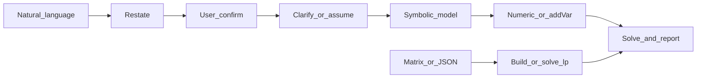

# Lineáris program (Linear Program, LP) megoldása COPT-tal

## Alkalmazási területek

- Lineáris cél: `min` vagy `max` alakú `c^T x`
- Lineáris korlátozások: `A_ub x <= b_ub`, `A_eq x == b_eq` (akár csak egyik, akár kombinációjuk)
- Változóhatárok: minden `x_j` rendelkezhet alsó, felső korláttal (vagy lehet korlátlan)

**Bemenet**: lehet **természetes nyelvű/szöveges feladat** vagy **megadott együtthatómátrix, illetve JSON**. Ne várd el alapértelmezetten, hogy a felhasználó előbb mátrixba rendezze; JSON-mezőket vagy `solve_lp`-t csak akkor használj, ha mátrixot adott vagy a szimbolizálás már elkészült.

## Quick Start (ezt végezd el először)

Kövesd a listát, és a válaszban őrizd meg a szerkezetet:

- [ ] Útvonalválasztás: természetes nyelv vagy megadott mátrix/JSON
- [ ] Újrafogalmazás kiírása (1–2 mondat)
- [ ] **Kérd a felhasználót, hogy erősítse meg az újrafogalmazás helyességét** (eltérés esetén tisztázz, különben folytasd)
- [ ] Változók/cél/korlátozások felsorolása (szimbolizálás)
- [ ] Szükség esetén lényeges tisztázó kérdések feltevése vagy feltételezések egyértelmű rögzítése
- [ ] Megoldási eredmény megadása (célérték + változóértékek)
- [ ] Az üzleti jelentés 1–2 mondatos magyarázata

## Végrehajtási folyamat (két út)



### A út: meglévő mátrix vagy JSON

1. Ellenőrizd a dimenziókat: `c` hossza, az `A` sorai és oszlopai, a `b` hossza és a korlátozások száma legyen összhangban.
2. Használd a [scripts/solve_lp.py](scripts/solve_lp.py) `solve_lp` függvényét, vagy írd meg közvetlenül a `coptpy` modellt a „Kézzel felépített modell” szerint (ez elnevezett változóknál és ritka szerkezetnél célszerű).

### B út: természetes nyelv / alkalmazási feladat

Ha nincs numerikus mátrix, az Agent **ne** kérjen először JSON-t. Az alábbi átadandó elemek sorrendjében haladj:

| Lépés | Tartalom |
|------|------|
| 1. Újrafogalmazás | Egy-két mondatban fogalmazd újra a feladatot, hogy a felhasználó ellenőrizhesse a megértést. |
| 2. Felhasználói megerősítés | **Kérd a felhasználót**, hogy erősítse meg a pontosságot; eltérésnél tisztázz, egyetértésnél folytasd. |
| 3. Szimbolizálás | **Változótábla**: név, jelentés, mértékegység (ha van), nemnegativitás. **Cél**: min vagy max, lineáris kifejezés. **Korlátozások**: egyenként, `<=` / `>=` / `=` jelöléssel. |
| 4. Numerikus alak | Írd `c`, `A_ub`/`b_ub`, `A_eq`/`b_eq`, `bounds` formába; vagy a sűrű mátrix kihagyásával modellezz közvetlenül `addVar` + `addConstr` + beszédes korlátozásnév használatával. |
| 5. Megoldás és válasz | Add meg az optimumot és a változóértékeket; szükség esetén egy mondatban értelmezd gazdasági/fizikai jelentését. |

## Kimeneti sablon (ajánlott)

```markdown
### A probléma újrafogalmazása
...

### Szimbolikus modell
- Döntési változók: ...
- Célfüggvény: ...
- Korlátozások: ...

### Numerikus alak (opcionális)
- c: ...
- A_ub / b_ub: ...
- A_eq / b_eq: ...
- bounds: ...

### Megoldási eredmény
- status: ...
- objective: ...
- x: ...

### Az eredmény értelmezése
...
```

## Kétértelműségek és tisztázás

Ha modellezés előtt hiányos az információ, **elsősorban kérdezz**. Szokásos tankönyvi feladatnál **sorold fel a feltételezéseket, majd oldd meg**, és ezeket írd bele az újrafogalmazásba:

- A cél **költség/erőforrás minimalizálása** vagy **profit/hasznosság maximalizálása**?
- „legfeljebb / nem több mint” általában `<=`; „legalább / nem kevesebb mint” általában `>=` (ellenőrizd a változó oldalát).
- Megengedett-e **törtes megoldás**? A folytonos LP ezt alapértelmezetten megengedi; egész darabszám vagy 0–1 telephely esetén lásd a következő szakaszt, és ne oldd meg hallgatólagosan folytonos változókkal.
- **Nemnegativitás**: termelési és ráfordítási mennyiségeknél gyakori alapfeltevés `>=0`; ezt a változótáblában rögzíteni kell.
- **Többtermékes, többidőszakos, többdimenziós korlátozásoknál** ellenőrizd az indexek, mátrixsorok és -oszlopok egyértelmű megfelelését.

## Hatókör és nem LP esetek (e skill határa)

Ez a fájl **folytonos változós LP**-re vonatkozik. Az alábbiaknál jelezd, hogy a feladat túlmutat a tiszta LP-n, és MILP-re, nemlineáris vagy más modellezésre van szükség; **tilos** egész változókat ezt be nem jelentve folytonosra relaxálni:

- **Egész / 0–1 döntések**.
- **Másodfokú tagok, két változó szorzata, illetve szakaszonként lineáristól eltérő nemlinearitás**.
- **Logikai implikációk** („ha A-t választjuk, akkor kötelező …”), amelyekhez gyakran egész változók és Big-M kell.

Javasolható külön MILP skill vagy a `coptpy` egészértékű képességének bővítése; [scripts/solve_lp.py](scripts/solve_lp.py) **csak LP-t valósít meg**.

## Mátrix / JSON formátum (opcionális, reprodukálhatósághoz és szkripthez)

Numerikus eredmény meglétekor, vagy ha a felhasználó ezt a szerkezetet adja, használd:

- `sense`: `min` vagy `max`
- `c`: cél-együtthatóvektor, alak `(n,)`
- `A_ub` / `b_ub` (opcionális): **`A_ub @ x <= b_ub`** (a sorok száma megegyezik `b_ub` hosszával)
- `A_eq` / `b_eq` (opcionális): **`A_eq @ x == b_eq`**
- `bounds` (opcionális): `n` hosszú, minden elem `[lb, ub]`
  - `null` jelenti, hogy az oldal korlátlan: `[0, null]` azt jelenti, hogy `x >= 0` felső korlát nélkül; `[null, 10]` azt, hogy `x <= 10` alsó korlát nélkül (Python/JSON feldolgozás után ez gyakran `None`; a `solve_lp` kezeli a `None` és a `"null"` szöveget is)
  - konkrét számok is használhatók, például `0`, `-1.2`
- `time_limit` (opcionális): a megoldási idő felső határa másodpercben

További példák a `reference/` könyvtárban találhatók ([reference/README.md](reference/README.md)): a **mátrix JSON** példák a [reference/matrix-json-examples.md](reference/matrix-json-examples.md), a **természetes nyelv → modellezés** példák a [reference/natural-language-examples.md](reference/natural-language-examples.md) fájlban.

## Környezet és import

```python
import coptpy as cp
from coptpy import COPT
```

Korlátlan oldalon használj `lb=-COPT.INFINITY` vagy `ub=COPT.INFINITY` értéket.

## Függőségek és licenc (nincs automatikus telepítés)

Ez a skill nem tölti le automatikusan a COPT-ot; a licencet és telepítést rendszerint kézzel kell elvégezni.

- **`ModuleNotFoundError: No module named 'coptpy'`**: a jelenlegi környezetben futtasd: `pip install coptpy` (szükség esetén `pip install --upgrade coptpy`).
- **A License nem található / licenchiba**: telepítsd vagy konfiguráld a COPT-licencet; a licencefájlt rendszerint egy rögzített könyvtárba teszik, a **`COPT_LICENSE_DIR`** környezeti változót pedig erre a könyvtárra állítják, majd újraindítják a Pythont vagy az IDE-t.
- **A COPT solver nincs telepítve**: szerezd be a rendszerhez illeszkedő telepítőt a hivatalos forrásból (például Windows x64), majd telepítsd a `coptpy`-t vagy kövesd a gyártó Python-interfészre vonatkozó útmutatóját.

## Kézzel felépített modell (a mátrixsablonnal egyenértékű)

Ha nem a `scripts/solve_lp.py` fájlt írod, hanem közvetlenül `coptpy`-t használsz, az alábbi váz ajánlott; lineáris kifejezésekhez a `cp.quicksum` megbízható:

```python
env = cp.Envr()
model = env.createModel("lp")
# x = [model.addVar(lb=..., ub=..., name="..."), ...]
# model.addConstr(cp.quicksum(...) <= or == ...)
# model.setObjective(cp.quicksum(...), sense=COPT.MINIMIZE or COPT.MAXIMIZE)
model.setParam(COPT.Param.TimeLimit, 10.0)  # optional
model.solve()
# if model.status == COPT.OPTIMAL: obj = model.objval; each variable .x
```

## Állapot, önellenőrzés és felhasználói magyarázat

**Megoldás előtti önellenőrzés**

- `len(c) == n`; `A_ub` és `A_eq` oszlopszáma `n`; `len(b_ub)` és `len(b_eq)` rendre az egyenlőtlenségi és egyenlőségi sorok számával egyezik.
- Ha a `bounds` hiányzik, a `solve_lp` változói alapértelmezetten **tetszőleges valósak**; ha a feladat nemnegativitást feltételez, ezt `bounds`-szal explicit meg kell adni, vagy módosítani kell az alapértéket.

**Megoldás utáni állapotok**

- `COPT.OPTIMAL`: létezik véges optimális megoldás.
- `COPT.INFEASIBLE`: **a megengedett tartomány üres**; a korlátozások és korlátok ellentmondanak, vagy egy egyenlőtlenség iránya hibás.
- `COPT.UNBOUNDED`: a megengedett tartomány a célt javító irányban korlátlan; gyakran korlát vagy feltétel hiányzik, illetve felcserélt `<=`/`>=` okozza.

## Szkript: `solve_lp`

A teljes megvalósítás a [scripts/solve_lp.py](scripts/solve_lp.py) fájlban van (`bounds` kezeli a `None` / `"null"` értékeket a JSON-feldolgozással összhangban).

Projektben vagy REPL-ben add a skill gyökerében levő `scripts` könyvtárat a modulkeresési útvonalhoz, vagy másold a fájlt a projektbe:

```python
import sys
from pathlib import Path

sys.path.insert(0, str(Path(__file__).resolve().parent / "scripts"))  # adjust to the actual path
from solve_lp import solve_lp

result = solve_lp(
    c=[3, 5],
    A_ub=[[1, 2], [2, 1]],
    b_ub=[100, 120],
    bounds=[(0, None), (0, None)],
    sense="max",
)
```

A COPT konfigurálása után közvetlenül is futtatható: `python scripts/solve_lp.py` (a beépített minimális füstteszt megegyezik a [reference/natural-language-examples.md](reference/natural-language-examples.md) „0. példa: kéttermékes gyártás” esetével).

A végponttól végpontig tartó „természetes nyelv → szimbólum → JSON” példafeladatokat a [reference/natural-language-examples.md](reference/natural-language-examples.md) tartalmazza (a 0. példa mellett szállítási, receptúra- és más feladatokkal).

## Modellezési tanácsok

- Az UNBOUNDED gyakori oka a szükséges alsó/felső korlát hiánya, illetve hogy a korlátozások nem zárják le a cél irányába mutató sugarat.
- A bal oldali lineáris kifejezéshez inkább `cp.quicksum`-ot használj: általában világosabb és hatékonyabb, mint sok `+` kézi összefűzése.
