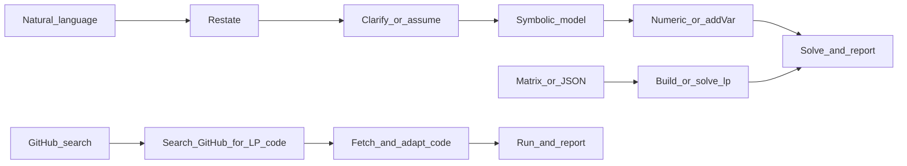

<!-- Szerző: Li Shuangxi -->

# Lineáris program (Linear Program, LP) megoldása

## Alkalmazási területek

- Lineáris cél: `min` vagy `max` alakú `c^T x`
- Lineáris korlátozások: `A_ub x <= b_ub`, `A_eq x == b_eq` (akár csak egyik, akár kombinációjuk)
- Változóhatárok: minden `x_j` rendelkezhet alsó és felső korláttal, vagy lehet korlátlan

**Bemenet**: lehet **természetes nyelvű/szöveges feladat** vagy **megadott együtthatómátrix, illetve JSON**. Ne várd el, hogy a felhasználó előbb mátrixba rendezze; JSON-mezőket vagy `solve_lp`-t csak megadott mátrix vagy elkészült szimbolizálás után használj.

## Quick Start (ezt végezd el először)

Kövesd az alábbi listát, és tartsd meg a válasz szerkezetét. **A környezet előkészítése a megoldás előtt kötelező.**

- [ ] **Környezet előkészítése és függőségek telepítése (kötelező első lépés)**:
  1. A `../or-solver/SKILL.md` alapján végezd el az egységes solverészlelést, -telepítést és -kiválasztást.
  2. Erősítsd meg, hogy a probléma LP, és a tartalékstratégia szerint válassz solvert.
  3. Ha egyik sem használható és a telepítés sikertelen, térj át a GitHub-keresési útra.
- [ ] Útvonalválasztás: természetes nyelv, megadott mátrix/JSON vagy GitHub-kód keresésének igénye.
- [ ] Solverválasztás: előnyben az elérhető solver (COPT > Gurobi > MOSEK > CPLEX > HiGHS (scipy/highspy) > CLARABEL > OR-Tools/GLOP > PuLP/CBC > ECOS > CVXOPT > GLPK > SoPlex > lpsolve); ha nincs, GitHub-keresés.
- [ ] Újrafogalmazás (1–2 mondat)
- [ ] Változók/cél/korlátozások felsorolása (szimbolizálás)
- [ ] Szükség esetén kulcsfontosságú tisztázó kérdések vagy egyértelmű feltételezések
- [ ] Megoldási eredmény (célérték + változóértékek)
- [ ] Üzleti jelentés 1–2 mondatos értelmezése

## Végrehajtási folyamat (három út)



### A út: meglévő mátrix vagy JSON

1. Ellenőrizd, hogy `c` hossza, az `A` sorai/oszlopai, `b` hossza és a korlátozások száma összhangban legyen.
2. Modellezd és oldd meg közvetlenül `coptpy`, `scipy.optimize.linprog` vagy `pulp` használatával.

### B út: természetes nyelv / alkalmazási feladat

Numerikus mátrix hiányában az Agent **ne** kérjen először JSON-t. Az átadandó elemek sorrendje:

| Lépés | Tartalom |
|------|------|
| 1. Újrafogalmazás | Egy-két mondatban fogalmazd újra a feladatot, hogy a felhasználó ellenőrizhesse a megértést. |
| 2. Szimbolizálás | **Változótábla**: név, jelentés, mértékegység (ha van), nemnegativitás. **Cél**: min vagy max, lineáris kifejezés. **Korlátozások**: egyenként, `<=` / `>=` / `=` jelöléssel. |
| 3. Numerikus alak | Írd `c`, `A_ub`/`b_ub`, `A_eq`/`b_eq`, `bounds` formába, vagy kerüld a sűrű mátrixot és modellezz közvetlenül `addVar` + `addConstr` + beszédes korlátozásnév használatával. |
| 4. Megoldás és válasz | Add meg az optimumot és a változóértékeket; szükség esetén egy mondatban értelmezd gazdasági/fizikai jelentését. |

### C út: nyílt forrású kód keresése a GitHubon

Ha nincs helyi LP-solver (például COPT nincs telepítve/nincs License, a scipy nem használható), **vagy a felhasználó kifejezetten GitHub-kódot kér**, ezt az utat használd.

**Step 1: keresés** — WebSearch segítségével keresd:
```
site:github.com linear programming solver python <problem feature>
```
Például: `site:github.com linear programming simplex solver python`, `site:github.com transportation problem lp solver python`.

**Step 2: szűrés** — előnyben a sok Star-ral, friss frissítéssel és README-vel rendelkező tárházak; tiszta Python-megvalósítások; ellenőrizd, hogy a kód a kívánt típust (folytonos LP / MILP stb.) támogatja.

**Step 3: kód beszerzése** — WebFetch-csel töltsd le a README-t és a kulcsfontosságú Python-fájlokat; értsd meg az API-t és a hívás módját.

**Step 4: adaptálás és futtatás** — alakítsd a felhasználó problémáját a kód bemeneti formátumára, írj hívószkriptet és futtasd. Hiba vagy inkompatibilitás esetén magyarázd el és próbáld javítani.

**Step 5: jelentés** — az alábbi sablonban jelentsd az eredményt és add meg a GitHub URL-t mint kódforrást.

## Kimeneti sablon (ajánlott)

```markdown
### Környezet és függőségek
- Python verzió: 3.x.x
- Környezetészlelés:
  - [telepítve] numpy 2.x.x
  - [telepítve] scipy 1.x.x (HiGHS solverrel)
  - [nincs telepítve] coptpy — a felhasználó nem kérte a telepítését
  - [nincs telepítve] pulp — pip install pulp (2.3s, telepítés sikeres ✓)
- Telepítési műveletek:
  - pip install pulp → sikeres (version 2.9.0)
- Elérhető solverek: HiGHS (scipy), PuLP/CBC
- Választott solver: scipy.optimize.linprog (method='highs')

### A probléma újrafogalmazása
...

### Szimbolikus modell
- Döntési változók: ...
- Célfüggvény: ...
- Korlátozások: ...

### Numerikus alak (opcionális)
- c: ...
- A_ub / b_ub: ...
- A_eq / b_eq: ...
- bounds: ...

### Megoldási eredmény
- status: ...
- objective: ...
- x: ...

### Korlátozások ellenőrzése
- 1. korlátozás: ... [OK]
- 2. korlátozás: ... [OK]

### Az eredmény értelmezése
...
```

## Kétértelműségek és tisztázás

Hiányos információ esetén modellezés előtt **elsősorban kérdezz**. Szokásos tankönyvi feladatnál **sorold fel a feltételezéseket, majd oldd meg**, és az újrafogalmazásban írd is le őket:

- A cél **költség/erőforrás minimalizálása** vagy **profit/hasznosság maximalizálása**?
- „legfeljebb / nem több mint” általában `<=`; „legalább / nem kevesebb mint” általában `>=` (ellenőrizd a változó oldalát).
- Megengedett-e **törtes megoldás**? A folytonos LP alapértelmezetten igen; egész darabszám vagy 0–1 telephely esetén lásd a következő szakaszt, és ne oldd meg hallgatólagosan folytonos változókkal.
- **Nemnegativitás**: termelési és ráfordítási mennyiségek esetén gyakori az `>=0` feltevés; ezt rögzíteni kell a változótáblában.
- **Többtermékes, többidőszakos, többdimenziós korlátozásoknál** ellenőrizd az indexek, mátrixsorok és -oszlopok egyértelmű megfelelését.

## Hatókör és nem LP esetek (e skill határa)

Ez a fájl **folytonos változós LP**-re vonatkozik. Az alábbi esetekben közöld, hogy ez túlmutat a tiszta LP-n, MILP-re, nemlineáris vagy más modellezésre van szükség; **tilos** egész változókat ezt be nem jelentve folytonosra relaxálni:

- **Egész / 0–1 döntések**.
- **Másodfokú tagok, két változó szorzata, illetve szakaszonként lineáristól eltérő nemlinearitás**.
- **Logikai implikációk**, amelyekhez gyakran egész változók és Big-M kell.

Javasolható külön MILP skill vagy a `coptpy` egészértékű képességeinek használata.

## Mátrix / JSON formátum (opcionális, reprodukálhatósághoz és szkripthez)

Használd, ha a numerikus alak már rendelkezésre áll, vagy a felhasználó ezt adja:

- `sense`: `min` vagy `max`
- `c`: cél-együtthatóvektor, alak `(n,)`
- `A_ub` / `b_ub` (opcionális): **`A_ub @ x <= b_ub`** (sorok száma egyezik `b_ub` hosszával)
- `A_eq` / `b_eq` (opcionális): **`A_eq @ x == b_eq`**
- `bounds` (opcionális): `n` hosszú, minden elem `[lb, ub]`
  - `null` azt jelenti, hogy az oldal korlátlan: `[0, null]` = `x >= 0` felső korlát nélkül; `[null, 10]` = `x <= 10` alsó korlát nélkül (Python/JSON feldolgozás után többnyire `None`; `solve_lp` a `None` és a `"null"` szöveget is kezeli)
  - konkrét számok is használhatók, például `0`, `-1.2`
- `time_limit` (opcionális): megoldási időkorlát másodpercben

További példák: [examples.md](examples.md), természetes nyelvű modellezéssel (gyártás, szállítás, receptúra, termelés-értékesítési terv) és mátrix JSON-formátummal.

## Solverzek

A solverészlelés, telepítés, License-konfiguráció és tartalékstratégia részletei: `../or-solver/SKILL.md`.

LP-solver prioritás: **COPT > Gurobi > MOSEK > CPLEX > HiGHS (scipy/highspy) > CLARABEL > OR-Tools/GLOP > PuLP/CBC > ECOS > CVXOPT > GLPK > SoPlex > lpsolve > GitHub keresés**.

Nyílt forrású első választás a HiGHS (`scipy.optimize.linprog` / `highspy`, MIT), oktatáshoz a `pulp` (CBC backend); kereskedelmi első választás COPT.

### Gyakori solverhívások

```python
# HiGHS — scipy/highspy (open-source first choice)
from scipy.optimize import linprog
result = linprog(c, A_ub=A_ub, b_ub=b_ub, A_eq=A_eq, b_eq=b_eq,
                 bounds=bounds, method='highs')
print(result.message, result.fun, result.x)

# PuLP/CBC (teaching first choice)
from pulp import LpProblem, LpVariable, LpMinimize, lpSum, value
prob = LpProblem("lp", LpMinimize)
x = [LpVariable(f"x{i}", lowBound=0) for i in range(n)]
prob += lpSum(c[i] * x[i] for i in range(n))
prob.solve()
print(value(prob.objective), [v.value() for v in x])

# COPT (commercial first choice; License required)
import coptpy as cp
from coptpy import COPT
env = cp.Envr()
model = env.createModel("lp")
x = [model.addVar(lb=0, ub=COPT.INFINITY, name=f"x{i}") for i in range(n)]
model.setObjective(cp.quicksum(c[i] * x[i] for i in range(n)), COPT.MINIMIZE)
model.solve()
```

## Kézzel felépített modell (a mátrixsablonnal egyenértékű)

Közvetlen `coptpy` modellhez a `cp.quicksum` biztonságos lineáris kifejezésekhez:

```python
env = cp.Envr()
model = env.createModel("lp")
# x = [model.addVar(lb=..., ub=..., name="..."), ...]
# model.addConstr(cp.quicksum(...) <= or == ...)
# model.setObjective(cp.quicksum(...), sense=COPT.MINIMIZE or COPT.MAXIMIZE)
model.setParam(COPT.Param.TimeLimit, 10.0)  # optional
model.solve()
# if model.status == COPT.OPTIMAL: obj = model.objval; each variable .x
```

## Állapot, önellenőrzés és felhasználói magyarázat

**Megoldás előtti önellenőrzés**

- `len(c) == n`; `A_ub` és `A_eq` oszlopszáma `n`; `len(b_ub)` és `len(b_eq)` rendre az egyenlőtlenségi és egyenlőségi sorok számával egyezik.
- Hiányzó `bounds` esetén a `solve_lp` változói alapértelmezetten **tetszőleges valósak**; implicit nemnegativitásnál explicit `bounds` kell vagy módosítani kell az alapértéket.

**Megoldás utáni állapotok**

- `COPT.OPTIMAL`: létezik véges optimális megoldás.
- `COPT.INFEASIBLE`: **a megengedett tartomány üres**; a korlátozások és korlátok ellentmondanak, vagy egyenlőtlenségi irány hibás.
- `COPT.UNBOUNDED`: a megengedett tartomány a célt javító irányban korlátlan; gyakran korlát/feltétel hiányzik vagy hibás `<=`/`>=` okozza.

## Modellezési példák és tanácsok

A [examples.md](examples.md) természetes nyelvű gyártási, szállítási, receptúra- és termelés-értékesítési példákat, valamint mátrix JSON-hívásokat tartalmaz.

- Az UNBOUNDED gyakori oka a szükséges alsó/felső korlát hiánya vagy a célirányú sugár elégtelen lezárása.
- A bal oldali lineáris kifejezéshez inkább `cp.quicksum`-ot használj: világosabb és általában hatékonyabb, mint a hosszú kézi `+` lánc.
- Ha `cvxpy`-vel építesz LP-t, a `cvx.Minimize(c @ x)` + `constraints` + `prob.solve(solver=...)` egységesen váltja a backendeket.
- Az OR-Tools GLOP nem kezel MILP-t; egész változókhoz válts SCIP vagy CBC backendre.
