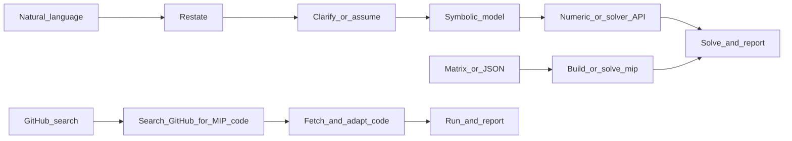

<!-- Szerző: Li Shuangxi -->

# Vegyes egészértékű programozás (Mixed-Integer Programming, MIP) megoldása

## Alkalmazási területek

- **Vegyes egészértékű lineáris programozás**: lineáris cél, lineáris korlátozások, a változók egy része vagy mindegyike egész.
- **Bináris döntési problémák**: telephelyválasztás, hozzárendelés, lefedés, be-/kikapcsolás, fixköltség-modellezés.
- **Kombinatorikus optimalizálási modellezés**: hátizsákprobléma, TSP, gyártásütemezés, járműútvonal-tervezés, hálózattervezés stb.
- **Linearizálható problémák**: logikai korlátozások, Big-M, indicator, SOS1/SOS2 stb.

**Bemenet**: lehet természetes nyelvű feladat/szöveges példafeladat, mátrix, JSON, meglévő modellkód vagy solverhiba is.

## Quick Start (ezt végezd el először)

Kövesd az alábbi ellenőrzőlistát, és a válaszban tartsd meg a szerkezetet. A környezet előkészítésének meg kell előznie a megoldást.

- [ ] **Környezet előkészítése és függőségek telepítése**:
  1. A `../or-solver/SKILL.md` alapján végezd el az egységes solverészlelést, -telepítést és -kiválasztást.
  2. Erősítsd meg, hogy a probléma MIP/MILP, és a tartalékstratégia szerint válassz solvert.
  3. Ha nincs használható solver és a telepítés sikertelen, térj át a GitHub-keresési útra.
- [ ] Útvonalválasztás: a felhasználó természetes nyelvet, mátrixot/JSON-t, kódot adott-e, vagy GitHub-kód keresését kéri.
- [ ] Szimbolizálás: sorold fel a változókat, típusaikat, a célt, a korlátozásokat és a mértékegységeket.
- [ ] Numerikus alak: adj meg mátrixot, JSON-t, vagy modellezz közvetlenül a solver API-jával.
- [ ] Megoldás és jelentés: állapot, célérték, változóértékek, MIP gap, megoldási idő.
- [ ] Ellenőrzés: vizsgáld a korlátozások megengedettségét és az egész változók értékeit.

## Végrehajtási folyamat (három út)



### A út: meglévő mátrix, JSON vagy modell

1. Ellenőrizd a dimenziókat, a változótípusokat, az alsó/felső korlátokat, a korlátozások irányát és a cél irányát.
2. Elsősorban a meglévő modellezési szerkezetet használd újra; ne kényszeríts ritka modellt sűrű mátrixba.
3. Oldd meg elérhető solverrel, és őrizd meg a solver állapotát és a napló lényeges részeit.

### B út: természetes nyelv / alkalmazási feladat

Ha a felhasználó nem adott numerikus mátrixot, ne kérj először JSON-t. Haladj ebben a sorrendben:

| Lépés | Tartalom |
| --- | --- |
| 1. Újrafogalmazás | Egy-két mondatban fogalmazd újra a feladatot, hogy a felhasználó megerősíthesse. |
| 2. Változók | Sorold fel a változó nevét, jelentését, mértékegységét és típusát (binary/integer/continuous). |
| 3. Modell | Írd le a célfüggvényt és a korlátozásokat, valamint jelöld `<=` / `>=` / `=` formában. |
| 4. Megoldás | Modellezd és oldd meg; jelentsd a célértéket, változóértékeket, gapet és állapotot. |
| 5. Értelmezés | Egy-két mondatban magyarázd el az üzleti jelentést, és szükség esetén a feltételezéseket. |

### C út: nyílt forrású kód keresése a GitHubon

Ha helyben nincs használható solver, vagy a felhasználó kifejezetten GitHub-kódot kér, keresd ezt:

```text
site:github.com mixed integer programming solver python <problem feature>
```

Előnyben részesítendők a frissen karbantartott, README-vel rendelkező, tiszta Python- vagy elterjedt solverinterfészt használó projektek. A README és a kulcsfájlok letöltése után igazítsd a kódot a felhasználói adatokhoz, és jelöld meg a forrást.

## Kimeneti sablon (ajánlott)

```markdown
### Környezet és függőségek
- Python verzió: ...
- Elérhető solverek: ...
- Választott solver: ...

### A probléma újrafogalmazása
...

### Szimbolikus modell
- Döntési változók: ...
- Célfüggvény: ...
- Korlátozások: ...

### Megoldási eredmény
- status: ...
- objective: ...
- variables: ...
- mip_gap: ...

### Ellenőrzés és értelmezés
...
```
