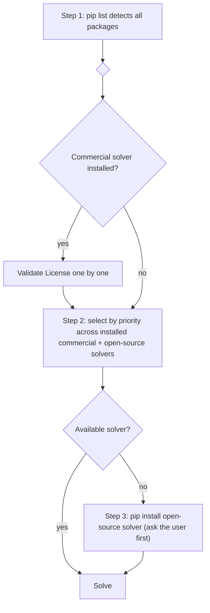

<!-- Szerző: Li Shuangxi -->

# Operációkutatási optimalizáló solverzek egységes konfigurációja

## Alkalmazási területek

Ez a skill egységes solverészlelést, telepítést és választást ad a következő OR skillekhez:

- **LP** (lineáris programozás) → `../linear-programming/SKILL.md`
- **MIP** (vegyes egészértékű programozás) → `../mixed-integer-programming/SKILL.md`
- **SOCP** (másodrendű kúp programozás) → `../second-order-cone-programming/SKILL.md`

Amikor az LP / MIP / SOCP skill Quick Start első lépéseként környezetet kell előkészíteni, e skill észlelési és telepítési folyamatát kell meghívni, nem különálló solverkezelő kódot fenntartani.

## Quick Start (solver-környezet előkészítése)

Alapelv: **először észlelés, utána osztályozás, végül tervezés**. Ne tegyél előfeltevést.



### Step 1: egységes észlelés

Futtasd a következő parancsot az összes solvercsomag egyszerre történő észleléséhez:

```bash
pip list | findstr -i "coptpy gurobipy mosek cplex pyscipopt highspy clarabel pulp mip ortools ecos scs cvxopt cosmo osqp swiglpk scipy lpsolve55 numpy cvxpy"
```

Unix rendszeren a `findstr -i` helyett `grep -iE` használandó.

Az eredmény két fő csoportja:

| Kategória | Csomagok |
|------|--------|
| Kereskedelmi solverek (License szükséges) | `coptpy`, `gurobipy`, `mosek`, `cplex` |
| Nyílt forrású solverek (License nélkül) | `scipy`, `highspy`, `pulp`, `cvxpy`, `clarabel`, `ecos`, `scs`, `cvxopt`, `cosmo`, `osqp`, `pyscipopt`, `mip`, `ortools`, `swiglpk`, `lpsolve55` |
| Alapfüggőség | `numpy` |

### Step 2: kategorizált ellenőrzés + választás

#### 2a. Kereskedelmi solverzek License-ének ellenőrzése (csak telepítetteknél)

Minden észlelt kereskedelmi solvert egyenként ellenőrizz. **Ne feltételezd, hogy „valószínűleg nincs”**: ami a felhasználó gépén van, azt ellenőrizd. A License-t **modell tényleges létrehozásával** ellenőrizd, nem csak importtal:

| Solver | License-ellenőrzési mód |
|--------|-------------------------|
| COPT | `import coptpy as cp; cp.Envr().createModel("_t")` — kivétel esetén nincs License |
| Gurobi | `import gurobipy as gp; gp.Model("_t")` — kivétel esetén nincs License (v13+ korlátozott License-t ad) |
| MOSEK | cvxpy-n át: `prob.solve(solver=cvx.MOSEK)` — a puszta `mosek.Env()` próbaverziót használhat, de a **cvxpy híváshoz formális `mosek.lic` kell** |
| CPLEX | cvxpy-n át: `prob.solve(solver=cvx.CPLEX)` — v22.1+ akadémiai License-t tartalmaz |

Érvényes License esetén jelöld a solvert használhatónak. Hiányzó License-nél mondd el a kérelmezés módját (lásd „License-konfiguráció”), jelöld használhatatlannak, és folytasd a többi solverrel.

#### 2b. A problématípus megerősítése

Állapítsd meg, hogy az aktuális probléma LP / MIP / SOCP.

#### 2c. Solver kiválasztása prioritás alapján

A Step 1 és 2a eredménye alapján válaszd az első használható solvert:

**LP prioritás**:
```
COPT > Gurobi > MOSEK > CPLEX > scipy/HiGHS > highspy > clarabel > pulp/CBC > ecos > cvxopt > glpk > lpsolve
```

**MIP prioritás**:
```
COPT > Gurobi > CPLEX > MOSEK > pyscipopt/SCIP > highspy > pulp/CBC > python-mip > OR-Tools/SCIP > OR-Tools/CP-SAT > glpk > lpsolve
```

**SOCP prioritás**:
```
COPT > Gurobi > MOSEK > CPLEX > clarabel > ecos > scs > cvxopt > cosmo > osqp
```

A kereskedelmi solverek csak akkor előznek meg másokat, ha telepítettek és a License érvényes; érvénytelen vagy nem telepített solver nem vesz részt a rendezésben.

### Step 3: hiányzó solverzek telepítése

Ha a prioritási listán nincs használható solver, kérd a felhasználó jóváhagyását nyílt forrású solver telepítéséhez:

```bash
pip install numpy scipy                          # LP only (scipy includes HiGHS)
pip install numpy pulp                            # LP + MIP (PuLP includes CBC)
pip install numpy scipy pulp cvxpy clarabel       # LP + MIP + SOCP (complete open-source set)
```

**Telepítés előtt kötelező a felhasználó engedélyét kérni.** Telepítés után térj vissza a Step 2c-hez. Kereskedelmi solvert csak kifejezett kérésre vagy meglévő License konfigurálásakor telepíts.

### Step 4: solverjelentés

```markdown
### Környezet és függőségek
- Python verzió: 3.x.x
- Észlelési eredmény:
  - Kereskedelmi solverek: COPT (✓ License OK) / Gurobi (✓) / MOSEK (✗ nincs License) / CPLEX (✓) / egyetlen kereskedelmi solver sem észlelhető
  - Nyílt forrású solverek: [telepítve] scipy x.x.x, pulp x.x.x, cvxpy x.x.x, clarabel x.x.x, ... / [nincs telepítve] ...
- Problématípus: LP / MIP / SOCP
- Választott solver: xxx (indok: legmagasabb prioritás a használhatók között / License érvényes / nyílt forrású, nulla konfiguráció)
```

---

## Solver–problématípus mátrix

| Solver | Csomagnév | LP | MIP | SOCP | Licenc | Telepítési parancs |
|--------|------|:--:|:--:|:----:|------|----------|
| **COPT** | `coptpy` | ✅ | ✅ | ✅ | kereskedelmi (akadémián ingyenes) | `pip install coptpy` |
| **Gurobi** | `gurobipy` | ✅ | ✅ | ✅ v11+ | kereskedelmi (akadémián ingyenes) | `pip install gurobipy` |
| **MOSEK** | `mosek` | ✅ | ✅ | ✅ | kereskedelmi (akadémián ingyenes) | `pip install mosek` |
| **CPLEX** | `cplex` | ✅ | ✅ | ✅ v20+ | kereskedelmi (akadémián ingyenes) | `pip install cplex` |
| **SCIP** | `pyscipopt` | △ | ✅ | ❌ | Apache 2.0 | `pip install pyscipopt` |
| **HiGHS** | `highspy` | ✅ | ✅ | ❌ | MIT | `pip install highspy` |
| **CLARABEL** | `clarabel` | ✅ | ❌ | ✅ | Apache 2.0 | `pip install clarabel` |
| **CBC** (PuLP) | `pulp` | ✅ | ✅ | ❌ | EPL | `pip install pulp` |
| **CBC** (python-mip) | `mip` | △ | ✅ | ❌ | EPL | `pip install mip` |
| **OR-Tools** | `ortools` | ✅ | ✅ | ❌ | Apache 2.0 | `pip install ortools` |
| **ECOS** | `ecos` | ✅ | ❌ | ✅ | GPLv3 | `pip install ecos` |
| **SCS** | `scs` | △ | ❌ | ✅ | MIT | `pip install scs` |
| **CVXOPT** | `cvxopt` | ✅ | ❌ | ✅ | GPLv3 | `pip install cvxopt` |
| **COSMO** | `cosmo` | △ | ❌ | ✅ | Apache 2.0 | `pip install cosmo` |
| **OSQP** | `osqp` | ✅ | ❌ | △ QP only | Apache 2.0 | `pip install osqp` |
| **GLPK** | `swiglpk` | ✅ | ✅ | ❌ | GPLv3 | `pip install swiglpk` |
| **scipy/HiGHS** | `scipy` | ✅ | ❌ | ❌ | MIT | `pip install scipy` |
| **SoPlex** | `pyscipopt` | ✅ | ❌ | ❌ | Apache 2.0 | installed with SCIP |
| **lpsolve** | `lpsolve55` | ✅ | ✅ | ❌ | LGPL | `pip install lpsolve55` |
| **cvxpy** | `cvxpy` | △ | △ | ✅ | Apache 2.0 | `pip install cvxpy` |

**Jelmagyarázat**: ✅ teljes támogatás · △ részleges/korlátozott támogatás · ❌ nem támogatott

- A `cvxpy` nem solver, hanem egységes SOCP/LP modellezési interfész, amely CLARABEL/ECOS/SCS stb. backendet hív; SOCP-hez a cvxpy telepítése kötelező.
- `scipy` >= 1.6.0 tartalmaz HiGHS-t, de a `scipy.optimize.linprog` **nem támogat egész változókat**. MIP-hez a `highspy` natív interfész kell.
- SoPlex automatikusan a `pyscipopt` része, és SCIP alapértelmezett LP-solvere.
- OR-Tools három backendet tartalmaz: GLOP (csak LP), SCIP (LP+MIP), CP-SAT (kombinatorikus optimalizálás, nem standard MIP).
- A △ jelölések: SCIP LP-n használható a beágyazott SoPlex miatt, de nem javasolt pusztán LP-re; python-mip alsó CBC-rétege tud LP-t, de a felülete MIP-orientált; COSMO LP-t az LP ⊂ SOCP miatt megoldhat, de pontossága/hatékonysága gyengébb; SCS elsőrendű ADMM, közelítő megoldást ad.

---

## Telepítési útmutató

### Egyparancsos telepítés problématípus szerint

```bash
# LP only (minimal installation, no extra dependencies)
pip install numpy scipy

# LP + MIP (covers common cases)
pip install numpy pulp

# LP + MIP + SOCP (complete open-source set, covers all skills)
pip install numpy scipy pulp cvxpy clarabel
```

```bash
# Commercial solvers (License must be acquired separately; see License configuration)
pip install coptpy gurobipy mosek cplex
```

### Egyedi solvertelepítés

```bash
# --- commercial solvers (License required) ---
pip install coptpy          # COPT — high-performance, commercial first choice
pip install gurobipy        # Gurobi — industry benchmark
pip install mosek           # MOSEK — conic optimization benchmark
pip install cplex           # IBM CPLEX

# --- recommended open-source ---
pip install highspy         # HiGHS (MIT) — open-source first choice for LP/MILP
pip install pyscipopt       # SCIP (Apache 2.0) — strong open-source MIP solver
pip install clarabel        # CLARABEL (Apache 2.0) — open-source first choice for SOCP
pip install pulp            # PuLP + CBC (EPL) — teaching first choice
pip install mip             # python-mip (EPL) — modern CBC interface
pip install ortools         # OR-Tools (Apache 2.0) — Google

# --- open-source fallbacks ---
pip install ecos            # ECOS (GPLv3) — embedded conic optimization
pip install scs             # SCS (MIT) — large-scale conic optimization ADMM
pip install cvxopt          # CVXOPT (GPLv3) — classic interior-point method
pip install cosmo           # COSMO (Apache 2.0) — ADMM conic optimization
pip install osqp            # OSQP (Apache 2.0) — QP only

# --- system-level / third-party ---
pip install swiglpk         # GLPK (GPLv3) — requires system libglpk
pip install lpsolve55       # lpsolve (LGPL) — requires system lp_solve
```

### Telepítés utáni ellenőrzés

```python
# open-source solvers (minimal set)
import numpy; print(f"numpy={numpy.__version__}")
import scipy; print(f"scipy={scipy.__version__}")
from scipy.optimize import linprog; print("scipy/HiGHS OK")

# cvxpy + available backends
import cvxpy; print(f"cvxpy={cvxpy.__version__}, solvers={cvxpy.installed_solvers()}")

# commercial solvers (validate only when installed)
# COPT   — import coptpy as cp; cp.Envr().createModel("_t"); print("COPT OK")
# Gurobi — import gurobipy as gp; gp.Model("_t"); print(f"Gurobi {gp.__version__} OK")
# MOSEK  — import cvxpy as cvx; x=cvx.Variable(1); cvx.Problem(cvx.Minimize(x),[x>=1]).solve(solver=cvx.MOSEK); print("MOSEK OK")
# CPLEX  — import cvxpy as cvx; x=cvx.Variable(1); cvx.Problem(cvx.Minimize(x),[x>=1]).solve(solver=cvx.CPLEX); print("CPLEX OK")
```

---

## License-konfiguráció

### COPT

```bash
# Request an academic License at https://www.shanshu.ai/copt
# Set the environment variable to the License directory
export COPT_LICENSE_DIR=/path/to/copt/license
# Windows: set COPT_LICENSE_DIR=C:\path\to\copt\license
```

```python
import coptpy as cp
env = cp.Envr()
# createModel succeeds when the License is valid; otherwise it raises an exception
model = env.createModel("_license_check")
print("COPT license OK")
```

### Gurobi

```bash
# Gurobi 13+ includes a restricted License (non-production); no additional setup
# For a full academic License, register at https://www.gurobi.com/downloads/
# Run grbgetkey after installation to activate
grbgetkey <your-license-key>
```

```python
import gurobipy as gp
# Gurobi 13+ can create a model directly; an invalid license raises an exception
m = gp.Model("_license_check")
print(f"Gurobi {gp.__version__} license OK")
```

### MOSEK

```bash
# A bare MOSEK `mosek.Env()` may automatically activate a trial License,
# but a cvxpy call to MOSEK requires a formal mosek.lic file.
# Request it at https://www.mosek.com/products/academic-licenses/
# Put mosek.lic in ~/mosek/
mkdir -p ~/mosek
cp mosek.lic ~/mosek/
```

Teszteld cvxpy-n keresztül, mert ez a valódi hívási út:

```python
import cvxpy as cvx
x = cvx.Variable(1)
try:
    cvx.Problem(cvx.Minimize(x), [x >= 1]).solve(solver=cvx.MOSEK)
    print("MOSEK license OK (via cvxpy)")
except Exception as e:
    if 'license' in str(e).lower():
        print("MOSEK license missing! Request at https://www.mosek.com/products/academic-licenses/")
        print("and place mosek.lic in ~/mosek/")
    else:
        raise
```

### CPLEX

```bash
# CPLEX 22.1+ includes an academic License (usable after pip install)
# For a full commercial License, register at https://www.ibm.com/academic/ for IBM Academic Initiative
pip install cplex
# Or use the docplex high-level interface
pip install docplex
```

```python
import cvxpy as cvx
# Call CPLEX via cvxpy; an invalid license raises an exception
x = cvx.Variable(1)
cvx.Problem(cvx.Minimize(x), [x >= 1]).solve(solver=cvx.CPLEX)
print("CPLEX license OK")
```

---

## Gyakori hibák és hibaelhárítás

### Telepítési hibák

| Hiba | Ok | Megoldás |
|------|------|------|
| `ModuleNotFoundError: No module named 'coptpy'` | COPT nincs telepítve | `pip install coptpy` (License kell) |
| `ModuleNotFoundError: No module named 'gurobipy'` | Gurobi nincs telepítve | `pip install gurobipy` (License kell) |
| `ModuleNotFoundError: No module named 'pulp'` | PuLP nincs telepítve | `pip install pulp` |
| `ModuleNotFoundError: No module named 'highspy'` | HiGHS nincs telepítve | `pip install highspy` |
| `ModuleNotFoundError: No module named 'cvxpy'` | cvxpy nincs telepítve | `pip install cvxpy` |
| `ModuleNotFoundError: No module named 'pyscipopt'` | SCIP nincs telepítve | `pip install pyscipopt` |
| `ModuleNotFoundError: No module named 'mip'` | python-mip nincs telepítve | `pip install mip` |
| `ModuleNotFoundError: No module named 'ortools'` | OR-Tools nincs telepítve | `pip install ortools` |
| `ModuleNotFoundError: No module named 'ecos'` | ECOS nincs telepítve | `pip install ecos` |
| `ModuleNotFoundError: No module named 'clarabel'` | CLARABEL nincs telepítve | `pip install clarabel` |

### License-hibák

| Hiba | Ok | Megoldás |
|------|------|------|
| COPT: `License not found` | Licencefájl nem található | Állítsd be a `COPT_LICENSE_DIR` környezeti változót |
| Gurobi: `No Gurobi license found` | Nem aktivált vagy lejárt | Futtasd újra a `grbgetkey` aktiválást |
| MOSEK: `err_missing_license_file(1008)` | `mosek.lic` nincs a `~/mosek/` alatt | Ellenőrizd az útvonalat vagy igényelj új licencet |
| CPLEX: `No CPLEX license found` | Nincs telepítve vagy lejárt | Ellenőrizd az IBM Academic Initiative állapotát |

### Futásidejű hibák

| Probléma | Ok | Megoldás |
|------|------|------|
| `linprog` nem támogat egész változókat | scipy HiGHS csak LP | MIP-hez `highspy` natív interfész vagy pulp/CBC |
| SOCP-solver nem elérhető | cvxpy backend nincs telepítve | `pip install clarabel ecos scs` |
| MIP megoldása túl lassú | alapértelmezett gap túl kicsi / nincs időkorlát | Állíts `TimeLimit`-et és lazítsd a `RelGap`-et |
| Numerikus instabilitás / pontatlan megoldás | Big-M túl nagy / adatok nincsenek skálázva | Szűkítsd a Big-M-et, standardizáld az adatokat |
| cvxpy nem talál solvert | solvercsomag nincs telepítve vagy inkompatibilis | `python -c "import cvxpy; print(cvxpy.installed_solvers())"` |

---

## Integráció LP/MIP/SOCP skillekbe

A Quick Start környezet-előkészítő része erre a hívásra egyszerűsíthető:

```markdown
- [ ] **Környezet előkészítése és függőségek telepítése (kötelező első lépés)**:
  1. A `../or-solver/SKILL.md` szerint végezd el az egységes solverészlelést és telepítést
  2. Erősítsd meg az aktuális problématípust: [LP / MIP / SOCP]
  3. A tartalékstratégia szerint válassz solvert; használható solver hiányában telepíts
  4. Ellenőrizd a sikeres importot
```

Ezután közvetlenül az adott skill útvonalválasztásával és problémamodellezésével folytasd.

## Kapcsolódás GitHub-kereséshez

Az alábbi helyzetekben ne próbálkozz tovább helyi solver telepítésével; térj közvetlenül az adott skill „C út: GitHub keresés” részéhez:

- Minden solver telepítése sikertelen (hálózati/jogosultsági/rendszerkompatibilitási ok).
- A Python-környezet korlátozott (nem futtatható `pip install`).
- A felhasználó kifejezetten önálló nyílt forrású GitHub-megvalósítást kér.

Keresőkifejezések problématípusonként:
- LP: `site:github.com linear programming solver python`
- MIP: `site:github.com mixed integer programming solver python`
- SOCP: `site:github.com second order cone programming solver python`
