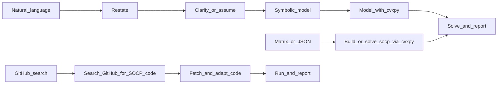

<!--
  Szerző: Li Shuangxi
  Benchmark adatforrás: CBLIB 2014 (Conic Benchmark Library)
  https://cblib.zib.de/
  Hivatkozás: Friberg, H.A. (2016). "CBLIB 2014: a benchmark library for conic
    mixed-integer and continuous optimization." Mathematical Programming
    Computation, 8(2), 191-214. DOI: 10.1007/s12532-015-0092-4
  Licenc: Copyright (c) 2012, Zuse Institute Berlin and Technical University
    of Denmark. Szabadon használható, a szerzői jogi nyilatkozatot meg kell őrizni, és tilos hamisan eredetiként feltüntetni.
-->

# Másodrendű kúp program (Second-Order Cone Program, SOCP) megoldása

## Alkalmazási területek

- **Standard SOCP**: lineáris cél + másodrendű kúpkorlátozás `||A_i x + b_i||_2 <= d_i^T x + e_i`
- **SOCP-re alakítható problémák**: másodfokú korlátozások (Cholesky-felbontással), tört célok (Charnes-Cooper transzformációval), valószínűségi korlátozások (normáleloszlás-feltevés mellett), Group Lasso stb.
- **Portfólió-optimalizálás**: kockázatminimalizálás, Sharpe-ráta maximalizálás, robusztus portfólió.
- **Robusztus optimalizálás**: lineáris programok robusztus párjai ellipszoid bizonytalansági halmaz mellett.
- **Mérnöki optimalizálás**: antennaarray-kalibráció, képlékeny határérték-analízis, FIR-szűrőtervezés stb.

**Bemenet**: lehet **természetes nyelvű/szöveges feladat** vagy **megadott együtthatómátrix, illetve JSON**.

## Quick Start (ezt végezd el először)

Kövesd a listát, és őrizd meg a válasz szerkezetét. **A környezet előkészítése a megoldás előtt kötelező.**

- [ ] **Környezet előkészítése és függőségek telepítése (kötelező első lépés)**:
  1. A `../or-solver/SKILL.md` szerint végezd el az egységes solverészlelést, telepítést és kiválasztást.
  2. Erősítsd meg, hogy a probléma SOCP, és a tartalékstratégia szerint válassz solvert.
  3. Ha egyik sem használható és a telepítés sikertelen, használd a GitHub-keresési utat.
- [ ] Útvonalválasztás: természetes nyelv, mátrix/JSON vagy GitHub-kód keresése.
- [ ] Solverválasztás: COPT > Gurobi > MOSEK > CPLEX > CLARABEL > ECOS > SCS > CVXOPT > COSMO > OSQP; használható solver nélkül GitHub-keresés.
- [ ] Problématípus: standard SOCP (kúpkorlátozás) vagy SOCP-re alakítható probléma.
- [ ] Újrafogalmazás (1–2 mondat), változók/cél/korlátozások szimbolizálása, szükséges tisztázások/feltételezések, eredmény (cél + változók), majd rövid üzleti értelmezés.

## Végrehajtási folyamat (három út)



### A út: meglévő mátrix vagy JSON

1. Ellenőrizd a cél-együtthatók, korlátozási mátrixok és kúpkorlátozási paraméterek dimenzióit.
2. Modellezd és oldd meg közvetlenül `cvxpy`-vel.

### B út: természetes nyelv / alkalmazási feladat

Numerikus mátrix nélkül az Agent **ne** kérjen először JSON-t. Haladj így:

| Lépés | Tartalom |
|------|------|
| 1. Újrafogalmazás | Egy-két mondatban fogalmazd újra a feladatot a megértés ellenőrzéséhez. |
| 2. Szimbolizálás | **Változótábla**: név, jelentés, mértékegység (ha van), nemnegativitás. **Cél**: min vagy max, lineáris kifejezés. **Korlátozások**: egyenként, lineáris vagy kúpkorlátozásként megjelölve. |
| 3. Numerikus alak | Írd `c`, kúpkorlátozási paraméterek stb. alakba, vagy modellezz közvetlenül `cvxpy.Variable` + `cvxpy.SOC` használatával. |
| 4. Megoldás és válasz | Add meg az optimumot és a változóértékeket; szükség esetén röviden értelmezd gazdasági/fizikai jelentését. |

### C út: nyílt forrású kód keresése a GitHubon

Ha nincs helyi SOCP-solver (`cvxpy` nincs telepítve, COPT/ECOS/SCS nem használható), **vagy a felhasználó kifejezetten GitHub-kódot kér**, használd ezt az utat.

1. **Keresés**: WebSearch segítségével:
```
site:github.com second order cone programming solver python <problem feature>
```
Példák: `site:github.com SOCP solver python cvxpy`, `site:github.com robust optimization second order cone python`.
2. **Szűrés**: előnyben a sok Star-ral, friss frissítéssel és README-vel rendelkező tárházak, a cvxpy- vagy numpy/scipy-alapú tiszta Python-kódok; ellenőrizd, hogy valóban SOCP-t támogatnak, nem csak LP-t vagy QP-t.
3. **Kód beszerzése**: WebFetch-csel töltsd le a README-t és a kulcsfontosságú Python-fájlokat, majd értsd meg az API-t.
4. **Adaptálás és futtatás**: alakítsd a feladatot a kód bemeneti formájára, írj hívószkriptet és futtasd. Hibánál vagy inkompatibilitásnál magyarázd el, és próbáld javítani.
5. **Jelentés**: az alábbi sablonban add meg az eredményt és a GitHub URL-t.

## Kimeneti sablon (ajánlott)

```markdown
### Környezet és függőségek
- Python verzió: 3.x.x
- Környezetészlelés:
  - [telepítve] numpy 2.x.x
  - [telepítve] cvxpy 1.x.x
  - [telepítve] scs 3.x.x (nyílt forrású MIT)
  - [nincs telepítve] coptpy — kereskedelmi szoftver, külön telepítés és License kell
  - [nincs telepítve] ecos — pip install ecos (1.5s, telepítés sikeres ✓)
- Telepítési műveletek:
  - pip install ecos → sikeres (version 2.0.14)
- cvxpy elérhető solverlista: ['SCS', 'ECOS', 'OSQP']
- Választott solver: SCS (tartalékválasztás, ha COPT nem használható)

### A probléma újrafogalmazása
...

### Szimbolikus modell
- Döntési változók: ...
- Célfüggvény: ...
- Lineáris korlátozások: ...
- Kúpkorlátozások: ...

### Numerikus alak (opcionális)
- c: ...
- Kúpkorlátozási paraméterek: ...

### Megoldási eredmény
- status: ...
- objective: ...
- x: ...

### Korlátozások ellenőrzése
- Lineáris korlátozások: maximális sértés x.xx [OK]
- Kúpkorlátozások: ||A_i x + b_i|| <= d_i^T x + e_i [OK]

### Az eredmény értelmezése
...
```

## Kétértelműségek és tisztázás

- **Kockázatminimalizálás**: tisztázd, hogy a kockázati mérték variancia vagy szórás; alapértelmezés a szórás (kúpkorlátozásos alak).
- **Bizonytalansági halmaz**: tisztázd a formát (ellipszoid, doboz, politóp); alapértelmezés az ellipszoid.
- **Shortolás megengedett-e**: portfóliófeladatban tisztázandó; alapértelmezés szerint nem megengedett (`w >= 0`).
- **Kockázatkerülési együttható**: ha nincs megadva, használható 1.0 alapérték a feltételezés rögzítésével.

## Hatókör és nem SOCP esetek (e skill határa)

Ez a fájl **konvex másodrendű kúp programokra** vonatkozik. A következőknél közöld, hogy a probléma túlmutat a tiszta SOCP-n:

- **Egész / 0–1 döntések** (vegyes egészértékű másodrendű kúp programozás, MISOCP).
- **Nemkonvex másodfokú korlátozások** (például kúppá nem alakított hiperbólikus forgatás).
- **Szemidefinit programozás (SDP)** (mátrixváltozók és lineáris mátrixegyenlőtlenségek).

Egész rész kezeléséhez javasolható a `coptpy` egészértékű képessége vagy a MILP skill.

## Solverzek

A solverészlelés, telepítés, License-konfiguráció és tartalékstratégia: `../or-solver/SKILL.md`.

SOCP-prioritás: **COPT > Gurobi > MOSEK > CPLEX > CLARABEL > ECOS > SCS > CVXOPT > COSMO > OSQP > GitHub keresés**.

A `cvxpy` egységes modellezési interfész, amely zökkenőmentesen vált backendeket. Nyílt forrású első választás `CLARABEL` (Apache 2.0, homogén beágyazott belsőpontos módszer, 2024), tartalék `ECOS` (GPLv3); kereskedelmi első választás a COPT.

### Gyakori solverhívások

```python
import numpy as np
import cvxpy as cvx

x = cvx.Variable(n)
objective = cvx.Minimize(c @ x)
constraints = [
    A_ub @ x <= b_ub,
    cvx.SOC(t, F @ x + g),   # ||F@x+g||_2 <= t
]

# CLARABEL (open-source first choice)
prob = cvx.Problem(objective, constraints)
prob.solve(solver=cvx.CLARABEL)

# COPT (commercial first choice; License required)
prob.solve(solver=cvx.COPT)

# ECOS (open-source fallback)
prob.solve(solver=cvx.ECOS)

print(prob.status, prob.value, x.value)
```

## Kézzel felépített modell (`cvxpy`-váz)

```python
import numpy as np
import cvxpy as cvx

x = cvx.Variable(n)
objective = cvx.Minimize(c.T @ x)

# linear constraints + second-order cone constraints
constraints = [
    A_ub @ x <= b_ub,                    # linear inequality
    A_eq @ x == b_eq,                    # linear equality
    cvx.SOC(t, F @ x + g),               # cone constraint: ||F@x+g||_2 <= t
]

prob = cvx.Problem(objective, constraints)
prob.solve(solver=cvx.COPT)  # or cvx.ECOS, cvx.SCS, cvx.MOSEK

print(prob.status, prob.value, x.value)
```

## Megoldási állapotok

- `optimal`: létezik véges optimális megoldás.
- `infeasible`: a megengedett tartomány üres; a korlátozások ellentmondanak.
- `unbounded`: a cél korlátlan; szükséges korlátozás hiányzik.
- `optimal_inaccurate`: a megoldás pontossága elégtelen; próbálj kisebb toleranciát vagy más solvert.

## Modellezési példák és tanácsok

Az [examples.md](examples.md) 10 teljes példát tartalmaz: alap SOCP, portfólió-optimalizálás, Sharpe-ráta, robusztus optimalizálás, több kúpkorlátozás, valószínűségi korlátozás, Group Lasso, legrosszabb eseti kockázat, antennaarray-kalibráció CBLIB nb_L2 és képlékeny határérték-analízis CBLIB qssp30.

- A másodrendű kúpkorlátozás standard alakja: `||A x + b||_2 <= d^T x + e`.
- Használd a `cvxpy.SOC(t, x)` formát, ahol `t` skalár változó és `||x||_2 <= t` szükséges.
- A `sqrt(w^T Sigma w)` portfóliókockázat a Cholesky-felbontás `L L^T = Sigma` segítségével `||L^T w||_2` alakra írható és kúpkorlátozásba tehető.
